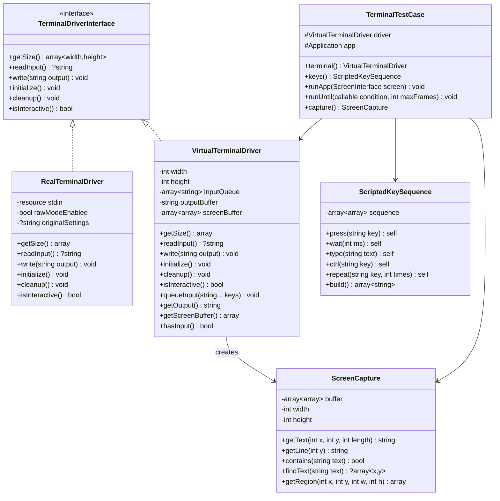
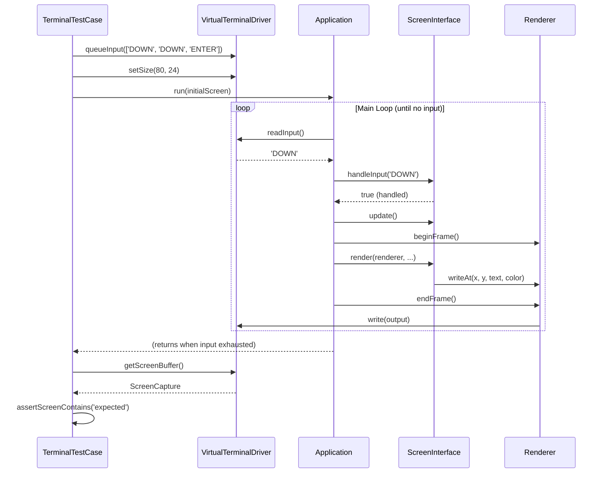
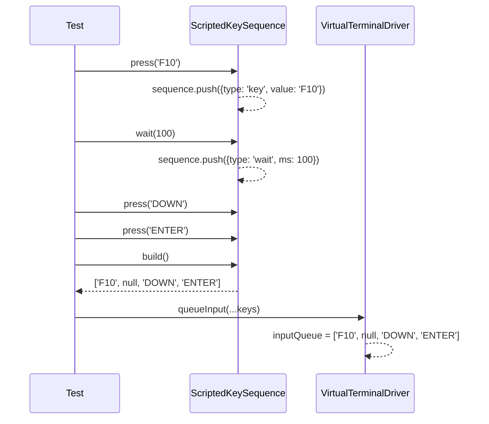

# Feature: Terminal Testing Framework (E2E & Integration)

## Overview

Create a comprehensive testing framework for the TUI application that allows testing user interactions, keyboard input
sequences, and screen state verification. The framework introduces a driver abstraction layer to decouple terminal I/O
from the core application logic, enabling both unit tests and end-to-end scenario testing.

### Business Value

- **Quality Assurance**: Catch regressions before they reach users
- **Developer Confidence**: Safely refactor complex UI logic
- **Documentation**: Tests serve as executable documentation of expected behavior
- **CI/CD Integration**: Automated verification on every commit

### Target Users

- Developers working on the terminal framework
- Contributors adding new screens or components
- QA engineers validating UI behavior

## Stage Dependencies

```
Stage 1 (Driver Abstraction) → Stage 2 (Virtual Terminal) → Stage 3 (Test Infrastructure)
                                                          → Stage 4 (Screen Assertions)
                                                          → Stage 5 (Integration Tests)
```

## Technical Architecture

### High-Level Design

The testing framework introduces a **Terminal Driver** abstraction that separates I/O operations from application logic.
This allows:

1. **Production**: Real terminal driver using STDIN/STDOUT and shell commands
2. **Testing**: Virtual terminal driver with scripted input and captured output

```
┌──────────────────────────────────────────────────────────────┐
│                      Application                              │
├──────────────────────────────────────────────────────────────┤
│  ScreenManager  │  KeyboardHandler  │  Renderer              │
├─────────────────┴───────────────────┴────────────────────────┤
│                  TerminalDriverInterface                      │
├──────────────────────────────────────────────────────────────┤
│  RealTerminalDriver  │  VirtualTerminalDriver                 │
│  (STDIN/STDOUT)      │  (In-memory buffers)                   │
└──────────────────────────────────────────────────────────────┘
```

### Integration with Existing Code

- **Minimal changes to existing classes**: Only constructor injection points added
- **Backward compatible**: Default to `RealTerminalDriver` when no driver specified
- **No breaking changes**: Existing API preserved

## Class Diagrams



## Sequence Diagrams

### Test Execution Flow



### Key Input Processing



## Public API / Interfaces

### TerminalDriverInterface

```php
<?php

namespace Butschster\Commander\Infrastructure\Terminal\Driver;

interface TerminalDriverInterface
{
    /**
     * Get terminal dimensions.
     * 
     * @return array{width: int, height: int}
     */
    public function getSize(): array;
    
    /**
     * Read next input character/sequence (non-blocking).
     * Returns null if no input available.
     */
    public function readInput(): ?string;
    
    /**
     * Write output to terminal.
     */
    public function write(string $output): void;
    
    /**
     * Initialize terminal (raw mode, alternate screen, etc).
     */
    public function initialize(): void;
    
    /**
     * Cleanup and restore terminal state.
     */
    public function cleanup(): void;
    
    /**
     * Check if terminal is interactive (real terminal vs pipe/file).
     */
    public function isInteractive(): bool;
}
```

### VirtualTerminalDriver

```php
<?php

namespace Butschster\Commander\Infrastructure\Terminal\Driver;

final class VirtualTerminalDriver implements TerminalDriverInterface
{
    /**
     * Set virtual terminal size.
     */
    public function setSize(int $width, int $height): void;
    
    /**
     * Queue input keys to be returned by readInput().
     * 
     * @param string ...$keys Key names like 'UP', 'ENTER', 'F10', 'CTRL_C'
     */
    public function queueInput(string ...$keys): void;
    
    /**
     * Queue raw key sequence (for special escape sequences).
     */
    public function queueRawInput(string $sequence): void;
    
    /**
     * Check if there's queued input remaining.
     */
    public function hasInput(): bool;
    
    /**
     * Get all output written to terminal.
     */
    public function getOutput(): string;
    
    /**
     * Clear output buffer.
     */
    public function clearOutput(): void;
    
    /**
     * Parse ANSI output and return screen buffer.
     * 
     * @return ScreenCapture
     */
    public function getScreenCapture(): ScreenCapture;
}
```

### ScriptedKeySequence (Builder)

```php
<?php

namespace Butschster\Commander\Testing;

final class ScriptedKeySequence
{
    /**
     * Add a key press.
     */
    public function press(string $key): self;
    
    /**
     * Add Ctrl+key combination.
     */
    public function ctrl(string $key): self;
    
    /**
     * Add Alt+key combination.
     */
    public function alt(string $key): self;
    
    /**
     * Type a string (individual character presses).
     */
    public function type(string $text): self;
    
    /**
     * Repeat a key N times.
     */
    public function repeat(string $key, int $times): self;
    
    /**
     * Insert a "frame boundary" - application processes all
     * previous keys before continuing.
     */
    public function frame(): self;
    
    /**
     * Build the key sequence array.
     * 
     * @return array<string|null> Keys (null = frame boundary)
     */
    public function build(): array;
}
```

### ScreenCapture

```php
<?php

namespace Butschster\Commander\Testing;

final readonly class ScreenCapture
{
    /**
     * Get text at position.
     */
    public function getText(int $x, int $y, int $length): string;
    
    /**
     * Get entire line (trimmed).
     */
    public function getLine(int $y): string;
    
    /**
     * Check if screen contains text anywhere.
     */
    public function contains(string $text): bool;
    
    /**
     * Find text position on screen.
     * 
     * @return array{x: int, y: int}|null
     */
    public function findText(string $text): ?array;
    
    /**
     * Get rectangular region as array of lines.
     * 
     * @return array<string>
     */
    public function getRegion(int $x, int $y, int $width, int $height): array;
    
    /**
     * Check if position has specific color.
     */
    public function hasColorAt(int $x, int $y, string $expectedColor): bool;
    
    /**
     * Dump screen to string for debugging.
     */
    public function dump(): string;
}
```

### TerminalTestCase

```php
<?php

namespace Butschster\Commander\Testing;

use PHPUnit\Framework\TestCase;

abstract class TerminalTestCase extends TestCase
{
    protected VirtualTerminalDriver $driver;
    
    /**
     * Get/configure the virtual terminal.
     */
    protected function terminal(): VirtualTerminalDriver;
    
    /**
     * Create a key sequence builder.
     */
    protected function keys(): ScriptedKeySequence;
    
    /**
     * Run application with initial screen until input exhausted.
     */
    protected function runApp(ScreenInterface $screen): void;
    
    /**
     * Run application until condition is met or max frames reached.
     * 
     * @param callable(ScreenCapture): bool $condition
     */
    protected function runUntil(callable $condition, int $maxFrames = 100): void;
    
    /**
     * Get current screen capture.
     */
    protected function capture(): ScreenCapture;
    
    // Assertions
    protected function assertScreenContains(string $text, string $message = ''): void;
    protected function assertScreenNotContains(string $text, string $message = ''): void;
    protected function assertTextAt(int $x, int $y, string $expected, string $message = ''): void;
    protected function assertLineContains(int $y, string $text, string $message = ''): void;
    protected function assertCurrentScreen(string $screenClass, string $message = ''): void;
    protected function assertScreenDepth(int $expected, string $message = ''): void;
}
```

## Directory Structure

```
src/
└── Infrastructure/
    └── Terminal/
        └── Driver/
            ├── TerminalDriverInterface.php    [New: Driver contract]
            ├── RealTerminalDriver.php         [New: Production driver]
            └── VirtualTerminalDriver.php      [New: Test driver]

tests/
├── TestCase.php                               [Base PHPUnit test case]
├── TerminalTestCase.php                       [TUI-specific test case]
├── Testing/
│   ├── ScriptedKeySequence.php                [Key sequence builder]
│   ├── ScreenCapture.php                      [Screen state capture]
│   └── AnsiParser.php                         [Parse ANSI output to buffer]
├── Unit/
│   └── Infrastructure/
│       └── Terminal/
│           └── Driver/
│               └── VirtualTerminalDriverTest.php
├── Integration/
│   └── Screen/
│       ├── FileBrowserScreenTest.php          [Example integration test]
│       └── MenuNavigationTest.php             [Menu system tests]
└── E2E/
    └── Scenario/
        ├── FileNavigationScenarioTest.php     [Full scenario test]
        └── ComposerManagerScenarioTest.php
```

## Code References

### Files to Modify

- `src/Infrastructure/Terminal/TerminalManager.php:1-130` - Extract I/O to driver, inject driver dependency
- `src/Infrastructure/Terminal/KeyboardHandler.php:1-220` - Use driver for input instead of STDIN
- `src/Infrastructure/Terminal/Renderer.php:1-200` - Use driver for output instead of echo
- `src/Application.php:40-60` - Accept optional driver, pass to components

### Integration Points

- `src/Application.php:175-185` - Main loop calls `handleInput()` - must use driver
- `src/Application.php:247-270` - `renderFrame()` writes to terminal - must use driver
- `src/Infrastructure/Terminal/KeyboardHandler.php:55-75` - `getKey()` reads from STDIN - must use driver
- `src/Infrastructure/Terminal/Renderer.php:140-170` - `endFrame()` writes output - must use driver
- `src/Infrastructure/Terminal/TerminalManager.php:25-45` - `getSize()` uses shell commands - wrap in driver

### Existing Test Infrastructure

- `composer.json:require-dev` - PHPUnit 10.5 already configured
- `composer.json:scripts.test` - `vendor/bin/phpunit` command exists
- `composer.json:autoload-dev` - `Tests\\` namespace mapped to `tests/`

## Development Progress

### Stage 1: Terminal Driver Abstraction

- [x] Substep 1.1: Create `TerminalDriverInterface` with all required methods
- [x] Substep 1.2: Create `RealTerminalDriver` extracting logic from `TerminalManager` and `KeyboardHandler`
- [x] Substep 1.3: Refactor `TerminalManager` to use driver (maintain BC with default driver)
- [x] Substep 1.4: Refactor `KeyboardHandler` to accept driver for input reading
- [x] Substep 1.5: Refactor `Renderer` to use driver for output writing
- [x] Substep 1.6: Update `Application` to accept and wire driver through components

**Notes**: Driver is optional with null default for backward compatibility. All existing public APIs preserved.
**Status**: Complete
**Completed**: All substeps

---

### Stage 2: Virtual Terminal Driver

- [x] Substep 2.1: Create `VirtualTerminalDriver` with configurable size
- [x] Substep 2.2: Implement input queue (`queueInput`, `readInput`, `hasInput`)
- [x] Substep 2.3: Implement output capture (`write`, `getOutput`, `clearOutput`)
- [x] Substep 2.4: Create `AnsiParser` to convert ANSI output to screen buffer
- [x] Substep 2.5: Implement `getScreenCapture()` returning parsed buffer
- [x] Substep 2.6: Add unit tests for `VirtualTerminalDriver`

**Notes**: Created ScreenCapture value object for screen state queries.
**Status**: Complete
**Completed**: All substeps

---

### Stage 3: Test Infrastructure

- [x] Substep 3.1: Create `phpunit.xml` configuration
- [x] Substep 3.2: Create base `TestCase.php` with common utilities
- [x] Substep 3.3: Create `ScreenCapture` value object with query methods
- [x] Substep 3.4: Create `ScriptedKeySequence` builder
- [x] Substep 3.5: Create `TerminalTestCase` with terminal setup and assertions
- [x] Substep 3.6: Verify framework works with simple smoke test

**Notes**: ScreenCapture already created in Stage 2. Added comprehensive smoke tests.
**Status**: Complete
**Completed**: All substeps

---

### Stage 4: Screen Assertions & Helpers

- [x] Substep 4.1: Implement `assertScreenContains` / `assertScreenNotContains`
- [x] Substep 4.2: Implement `assertTextAt` / `assertLineContains`
- [x] Substep 4.3: Implement `assertCurrentScreen` / `assertScreenDepth`
- [x] Substep 4.4: Implement `ScreenCapture::dump()` for debugging
- [x] Substep 4.5: Add color assertion helpers (optional)
- [x] Substep 4.6: Document assertion API with examples

**Notes**: Added extended assertions: ContainsCount, ContainsAll, ContainsAny, LineEquals, LineStartsWith, LineEmpty, TextOnLine, Region, ScreenTitle, ColorAt, TextHasColor. Debug helpers: dumpScreen, dumpScreenWithLines, dumpNonEmptyLines, pauseAndShow.
**Status**: Complete
**Completed**: All substeps

---

### Stage 5: Integration & E2E Tests

- [x] Substep 5.1: Create `FileBrowserScreenTest` - navigation, file selection
- [x] Substep 5.2: Create `MenuNavigationTest` - F10 menu, dropdown navigation
- [x] Substep 5.3: Create `TabContainerTest` - tab switching with Tab key
- [x] Substep 5.4: Create full scenario test: browse files → open viewer → close
- [x] Substep 5.5: Add CI configuration for automated test runs
- [x] Substep 5.6: Document testing patterns and best practices

**Notes**: Created comprehensive integration tests for FileBrowser and TabContainer. E2E tests for file workflows. CI configured for GitHub Actions. Documentation added for testing patterns.
**Status**: Complete
**Completed**: All substeps

---

## Implementation Considerations

### Potential Challenges

1. **ANSI Parsing Complexity**: Parsing terminal output with escape sequences requires handling colors, cursor movement,
   and screen clearing. Consider using a state machine parser.

2. **Frame Timing**: Tests need to control when frames are processed. The `frame()` method in key sequence builder
   addresses this.

3. **Async Operations**: If screens have async loading (spinners), tests need `runUntil()` with conditions.

4. **Terminal Size Edge Cases**: Components may behave differently at various sizes. Tests should cover min/max sizes.

### Edge Cases to Handle

- Empty input queue (should not block)
- Screen resize during test
- Multiple rapid key presses
- Unicode characters in output
- Very long lines wrapping
- Components that don't handle all keys

### Performance Considerations

- Virtual driver should be fast (no I/O)
- ANSI parser should handle large buffers efficiently
- Avoid unnecessary screen capture parsing

### Security Concerns

- None significant for testing framework
- Ensure virtual driver cannot accidentally affect real terminal

## Testing Strategy

### Unit Tests

- `VirtualTerminalDriverTest`: queue/read input, capture output, size handling
- `AnsiParserTest`: parse colors, cursor movement, clear sequences
- `ScreenCaptureTest`: text queries, region extraction, color checks
- `ScriptedKeySequenceTest`: builder methods, build output

### Integration Tests

- Screen-level tests with scripted input and state verification
- Menu system navigation tests
- Tab container switching tests
- Form input tests

### E2E Scenario Tests

```php
public function testCompleteFileWorkflow(): void
{
    $this->terminal()->setSize(80, 24);
    $this->keys()
        ->press('DOWN')->press('DOWN')  // Navigate to file
        ->press('ENTER')                 // Open
        ->frame()
        ->press('ESCAPE')               // Close viewer
        ->apply();
    
    $this->runApp(new FileBrowserScreen('/tmp'));
    
    // Should be back at file browser
    $this->assertCurrentScreen(FileBrowserScreen::class);
    $this->assertScreenContains('File Browser');
}
```

## Acceptance Criteria

### Definition of Done

- [ ] All existing application behavior works unchanged (no regressions)
- [ ] Can test any screen with scripted keyboard input
- [ ] Can verify screen content at any point during test
- [ ] Tests run in CI without real terminal
- [ ] Documentation covers common testing patterns
- [ ] At least 3 integration tests demonstrate framework usage

### Measurable Success Criteria

- Virtual driver passes all unit tests
- At least 80% code coverage on testing infrastructure
- Integration tests complete in under 5 seconds
- No flaky tests (100% deterministic)
- Works on Linux and macOS CI environments

## Usage Examples

### Basic Screen Test

```php
class FileBrowserTest extends TerminalTestCase
{
    public function testNavigateDown(): void
    {
        $this->terminal()->setSize(80, 24);
        $this->terminal()->queueInput('DOWN', 'DOWN', 'DOWN');
        
        $this->runApp(new FileBrowserScreen('/tmp'));
        
        // Verify 4th item is now selected (0-indexed line 3)
        $this->assertLineContains(5, '▶'); // Selection indicator
    }
}
```

### Menu Test

```php
class MenuTest extends TerminalTestCase
{
    public function testOpenFileMenu(): void
    {
        $this->terminal()->setSize(80, 24);
        $this->keys()
            ->press('F10')  // Open menu bar
            ->frame()
            ->press('ENTER') // Open first menu
            ->apply();
        
        $this->runApp(new MainScreen());
        
        $this->assertScreenContains('New');
        $this->assertScreenContains('Open');
        $this->assertScreenContains('Exit');
    }
}
```

### Condition-Based Test

```php
class AsyncScreenTest extends TerminalTestCase
{
    public function testWaitForLoading(): void
    {
        $this->terminal()->setSize(80, 24);
        
        $this->runUntil(
            fn(ScreenCapture $screen) => $screen->contains('Loading complete'),
            maxFrames: 200
        );
        
        $this->assertScreenContains('Data loaded successfully');
    }
}
```

## Usage Instructions

⚠️ Keep this checklist updated:

- Mark completed substeps immediately with [x]
- Add notes about deviations or challenges
- Document decisions differing from plan
- Update status when starting/completing stages
- Run `composer test` after each stage to verify
- Commit after each completed substep
