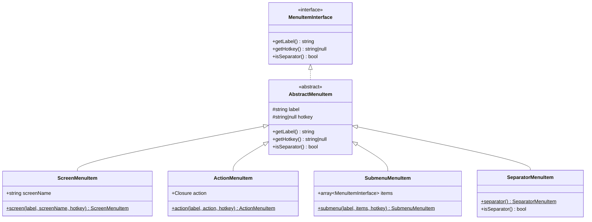
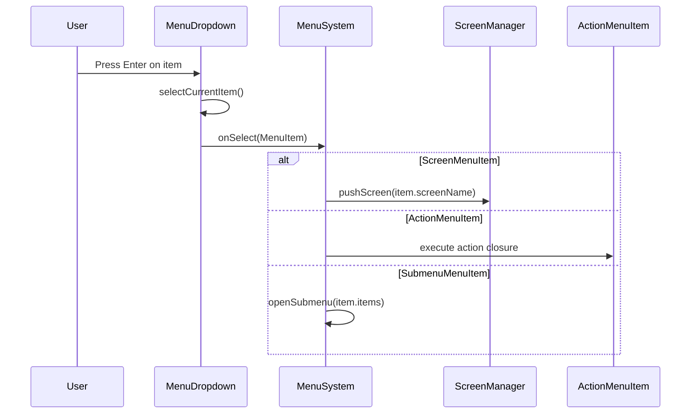
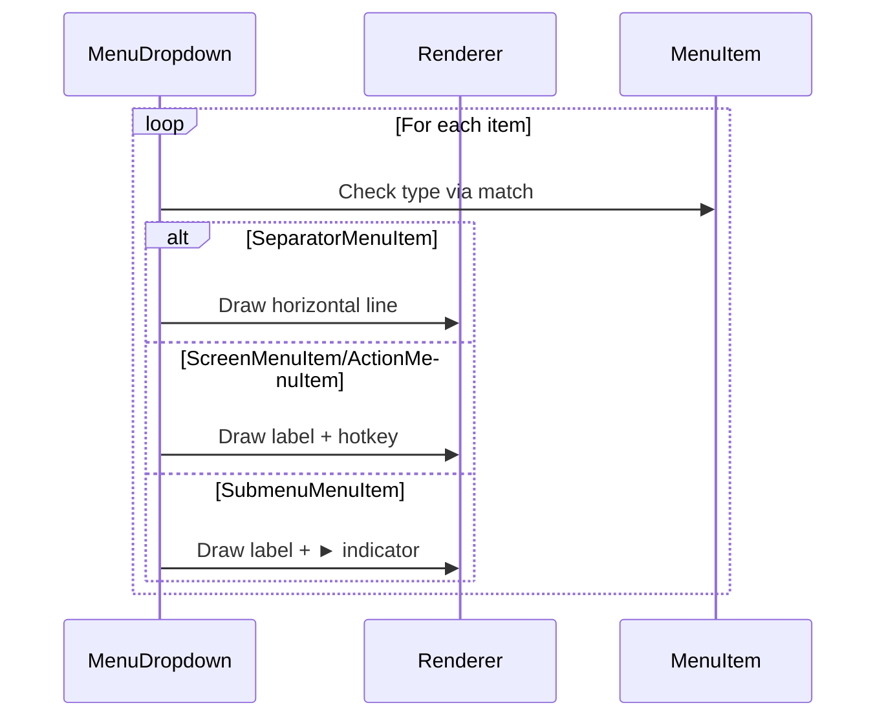

# FR-10: Polymorphic Menu Item Refactoring

## Feature Overview

### Description

Refactor the `MenuItem` class from a string-based type discrimination pattern to a polymorphic class hierarchy. This
eliminates runtime type checking (`isScreen()`, `isAction()`, etc.) and replaces nullable properties with type-safe,
purpose-built classes.

### Business Value

- **Maintainability**: Each menu item type is self-contained with only relevant properties
- **Type Safety**: Eliminates runtime errors from accessing wrong properties
- **Extensibility**: Adding new menu types requires no modification to existing code
- **Code Clarity**: Intent is explicit in class names rather than string constants

### Target Users

- Developers extending the Commander menu system
- Internal maintainers working on `MenuSystem` and `MenuDropdown`

---

## Technical Architecture

### High-Level Approach

Replace the single `MenuItem` class with an interface and four concrete implementations. The consuming code (
`MenuSystem`, `MenuDropdown`) will use pattern matching (`match` with `instanceof`) instead of method calls.

### Integration Points

The refactoring is localized to:

1. `src/UI/Menu/` — new class hierarchy
2. `src/UI/Component/Layout/MenuSystem.php` — update `handleMenuItemSelected()`
3. `src/UI/Component/Layout/MenuDropdown.php` — update `renderItem()` and type handling

### Technology Stack

- PHP 8.3 (constructor promotion, `readonly`, `match` expressions)
- No new dependencies

---

## Class Diagrams



---

## Sequence Diagrams

### Menu Item Selection Flow



### Rendering Flow



---

## Public API / Interfaces

### MenuItemInterface

```php
interface MenuItemInterface
{
    public function getLabel(): string;
    public function getHotkey(): ?string;
    public function isSeparator(): bool;
}
```

### AbstractMenuItem

```php
abstract readonly class AbstractMenuItem implements MenuItemInterface
{
    public function __construct(
        protected string $label,
        protected ?string $hotkey = null,
    ) {}
    
    public function getLabel(): string;
    public function getHotkey(): ?string;  // Returns lowercase hotkey or first char of label
    public function isSeparator(): bool;   // Returns false (overridden in SeparatorMenuItem)
}
```

### ScreenMenuItem

```php
final readonly class ScreenMenuItem extends AbstractMenuItem
{
    public function __construct(
        string $label,
        public string $screenName,
        ?string $hotkey = null,
    ) {}
    
    public static function create(string $label, string $screenName, ?string $hotkey = null): self;
}
```

### ActionMenuItem

```php
final readonly class ActionMenuItem extends AbstractMenuItem
{
    public function __construct(
        string $label,
        public \Closure $action,
        ?string $hotkey = null,
    ) {}
    
    public static function create(string $label, callable $action, ?string $hotkey = null): self;
}
```

### SubmenuMenuItem

```php
final readonly class SubmenuMenuItem extends AbstractMenuItem
{
    /** @param array<MenuItemInterface> $items */
    public function __construct(
        string $label,
        public array $items,
        ?string $hotkey = null,
    ) {}
    
    public static function create(string $label, array $items, ?string $hotkey = null): self;
}
```

### SeparatorMenuItem

```php
final readonly class SeparatorMenuItem extends AbstractMenuItem
{
    public function __construct() {}  // No parameters needed
    
    public static function create(): self;
    public function isSeparator(): bool;  // Returns true
}
```

---

## Directory Structure

```
src/UI/Menu/
├── MenuItemInterface.php      [NEW - Interface contract]
├── AbstractMenuItem.php       [NEW - Shared base implementation]
├── ScreenMenuItem.php         [NEW - Screen navigation item]
├── ActionMenuItem.php         [NEW - Closure execution item]
├── SubmenuMenuItem.php        [NEW - Nested menu item]
├── SeparatorMenuItem.php      [NEW - Visual separator]
├── MenuItem.php               [DELETE after migration]
├── MenuDefinition.php         [MODIFY - Update type hints]
└── MenuBuilder.php            [MODIFY - Use new classes]

tests/Unit/UI/Menu/
├── AbstractMenuItemTest.php   [NEW - Base class tests]
├── ScreenMenuItemTest.php     [NEW - Screen item tests]
├── ActionMenuItemTest.php     [NEW - Action item tests]
├── SubmenuMenuItemTest.php    [NEW - Submenu item tests]
└── SeparatorMenuItemTest.php  [NEW - Separator tests]

tests/Unit/Component/Layout/
└── MenuDropdownTest.php       [MODIFY - Update to new classes]
```

---

## Code References

### Files to Modify

| File                                               | Lines                      | Description                     |
|----------------------------------------------------|----------------------------|---------------------------------|
| `src/UI/Menu/MenuItem.php`                         | entire                     | Replace with new hierarchy      |
| `src/UI/Menu/MenuDefinition.php:16-17`             | `@param array<MenuItem>`   | Update to `MenuItemInterface`   |
| `src/UI/Menu/MenuBuilder.php:44-47`                | `MenuItem::screen()` calls | Use `ScreenMenuItem::create()`  |
| `src/UI/Menu/MenuBuilder.php:56-60`                | `MenuItem::action()` call  | Use `ActionMenuItem::create()`  |
| `src/UI/Component/Layout/MenuSystem.php:10`        | `use MenuItem`             | Update imports                  |
| `src/UI/Component/Layout/MenuSystem.php:259-271`   | `handleMenuItemSelected()` | Use `match` with `instanceof`   |
| `src/UI/Component/Layout/MenuDropdown.php:10`      | `use MenuItem`             | Update imports                  |
| `src/UI/Component/Layout/MenuDropdown.php:216-248` | `renderItem()`             | Use `instanceof` checks         |
| `src/UI/Component/Layout/MenuDropdown.php:142-149` | `findNextSelectableItem()` | Use `isSeparator()` (unchanged) |

### Current Type Checking Patterns to Replace

```php
// BEFORE (MenuSystem.php:259-271)
if ($item->isScreen()) {
    $this->navigateToScreen($item->screenName);
} elseif ($item->isAction()) {
    // ...
}

// AFTER
match (true) {
    $item instanceof ScreenMenuItem => $this->navigateToScreen($item->screenName),
    $item instanceof ActionMenuItem => ($item->action)(),
    $item instanceof SubmenuMenuItem => $this->openSubmenu($item->items),
    default => null,
};
```

---

## Implementation Considerations

### Potential Challenges

1. **Backward Compatibility**: If external code uses `MenuItem` directly, migration path needed
2. **Closure Serialization**: `ActionMenuItem` with closures cannot be cached/serialized

### Edge Cases

- Empty submenu arrays (should be validated in constructor)
- Null hotkeys falling back to first character of label
- Separator items being selected (should be skipped in navigation)

### Performance Considerations

- `instanceof` checks are highly optimized in PHP 8.3
- Memory usage similar (readonly classes are efficient)
- No performance regression expected

### Security Concerns

- Action closures should not be accepted from untrusted input
- No new attack surface introduced

---

## Testing Strategy

### Unit Tests

| Test Class              | Coverage                                                       |
|-------------------------|----------------------------------------------------------------|
| `ScreenMenuItemTest`    | Construction, `getLabel()`, `getHotkey()`, `screenName` access |
| `ActionMenuItemTest`    | Construction, closure execution, callable→Closure conversion   |
| `SubmenuMenuItemTest`   | Construction, nested items access                              |
| `SeparatorMenuItemTest` | `isSeparator()` returns true, label is separator char          |
| `AbstractMenuItemTest`  | Hotkey fallback to first label character                       |

### Integration Tests

| Scenario                            | Description                                       |
|-------------------------------------|---------------------------------------------------|
| `MenuBuilder` creates correct types | Verify `build()` returns proper item instances    |
| `MenuSystem` handles all item types | Navigate screen, execute action, handle separator |
| `MenuDropdown` renders all types    | Visual verification of each item type             |

### Existing Test Updates

| Test Class         | Changes Required                                        |
|--------------------|---------------------------------------------------------|
| `MenuDropdownTest` | Update imports, factory calls, type hints, property access |

### Edge Cases to Cover

- Hotkey collision handling
- Empty label strings
- Deeply nested submenus (3+ levels)
- Action throwing exceptions

---

## Acceptance Criteria

### Definition of Done

- [ ] All new classes created with full PHPDoc
- [ ] Old `MenuItem` class removed
- [ ] `MenuBuilder` uses new classes
- [ ] `MenuSystem.handleMenuItemSelected()` refactored
- [ ] `MenuDropdown.renderItem()` refactored
- [ ] All existing tests pass
- [ ] New unit tests achieve 100% coverage of new classes
- [ ] No `isScreen()`, `isAction()`, `isSubmenu()` method calls remain

### Measurable Success

- Zero runtime type errors related to menu items
- PHPStan level 8 passes without errors
- All E2E menu tests pass unchanged
