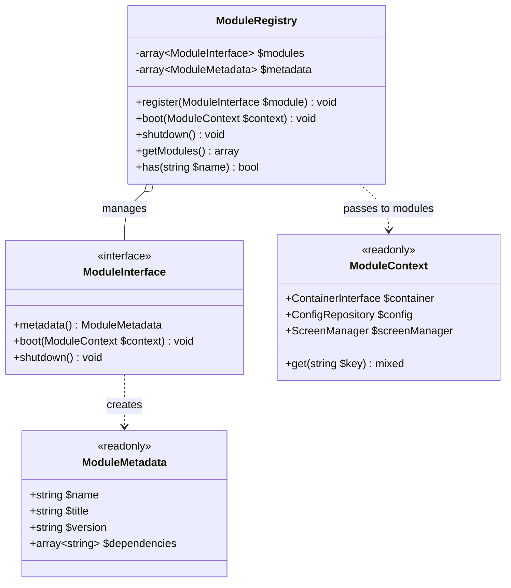
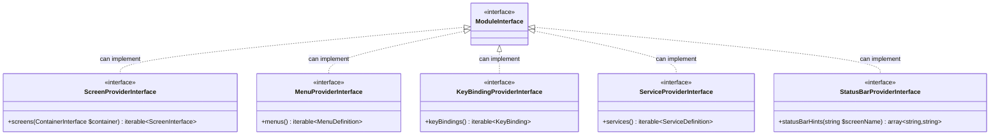
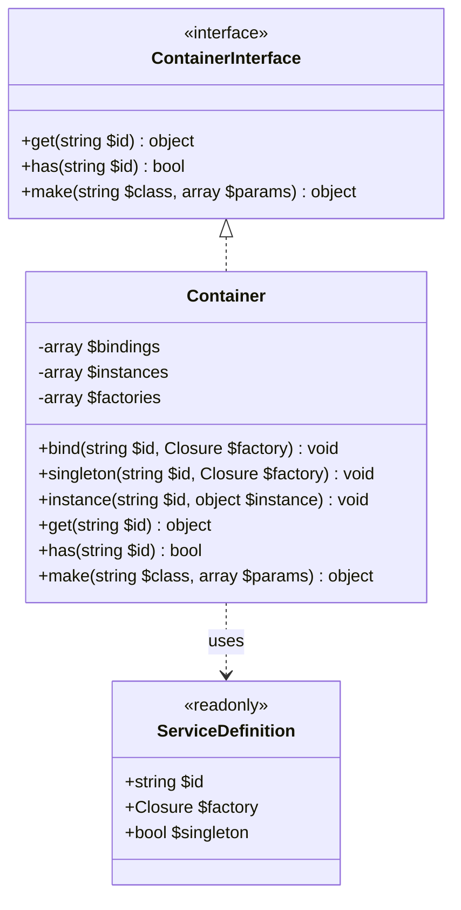
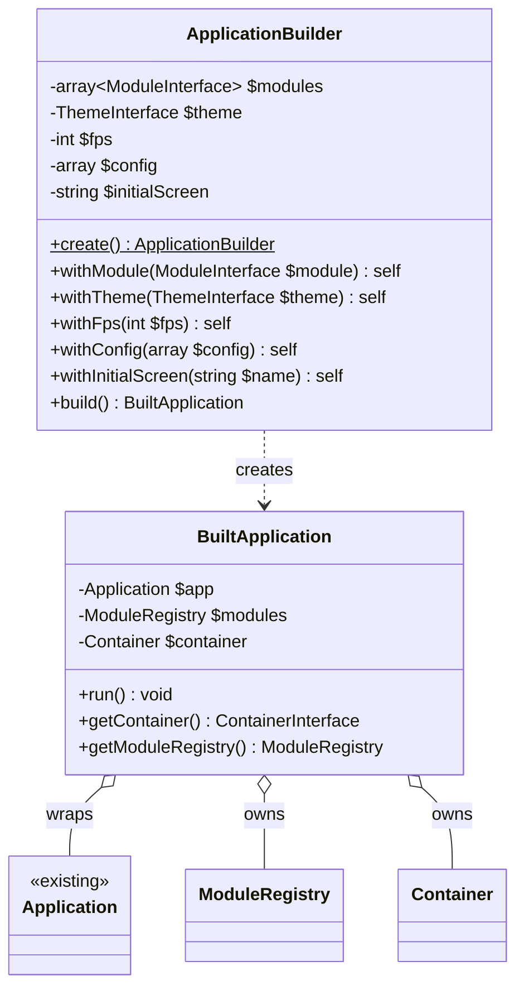
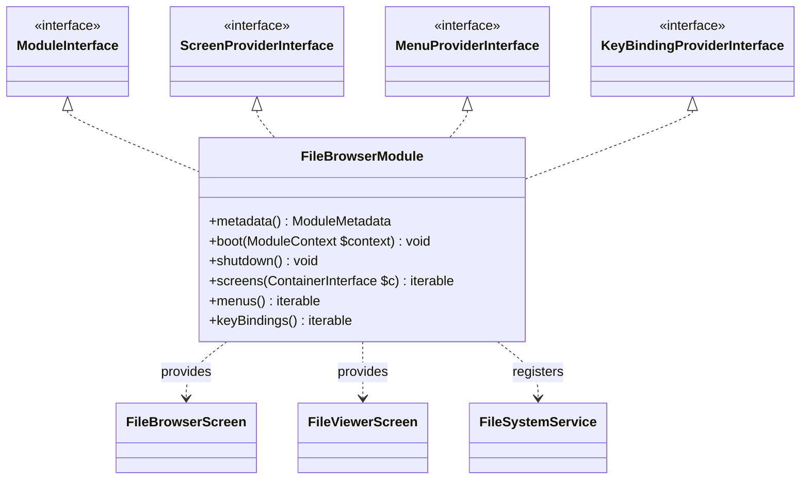
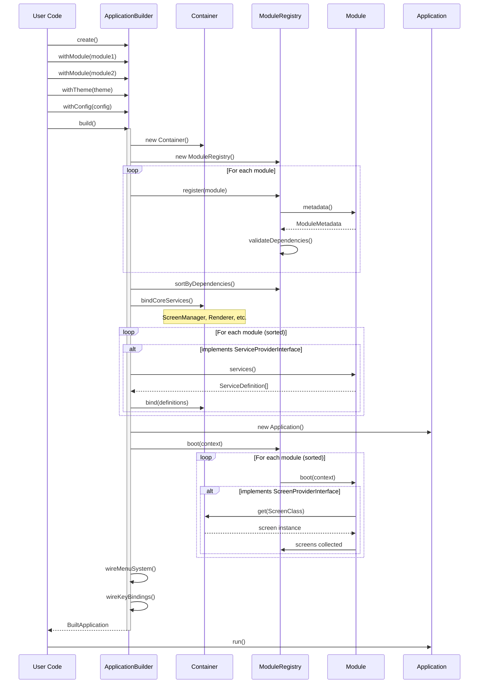
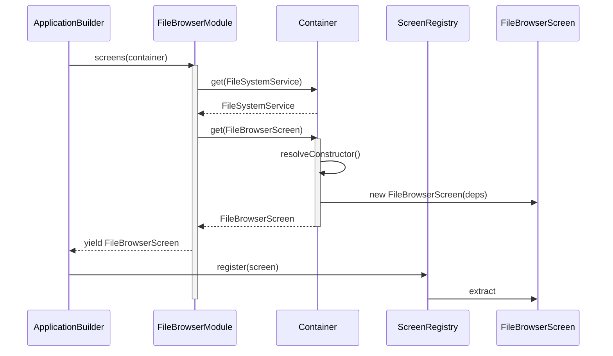
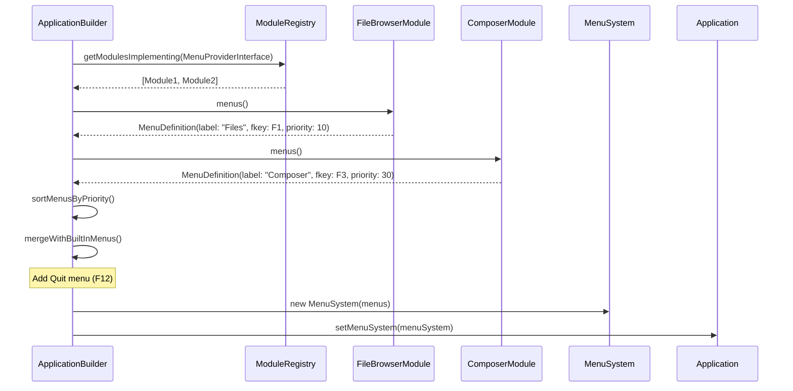
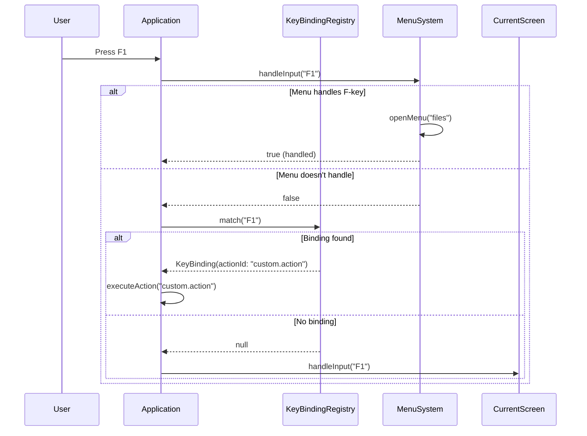
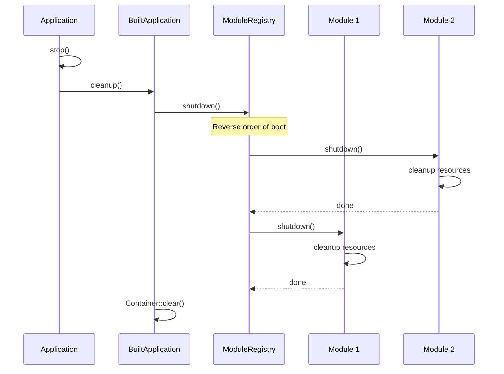

# Feature Request: Module SDK System

## Feature Overview

### Description

Create a comprehensive SDK for building external modules that can be plugged into the Commander terminal application.
The SDK provides contracts, builders, and utilities for third-party developers to create modules with their own screens,
menus, key bindings, and services.

### Business Value

- **Extensibility**: Allow the Commander package to be extended without modifying core code
- **Reusability**: Built-in features (FileBrowser, ComposerManager) become modules themselves
- **Ecosystem**: Third-party developers can create and distribute modules via Composer
- **Separation of Concerns**: Clear boundaries between core infrastructure and feature modules

### Target Users

1. **Package users** who want to build custom terminal UIs for their applications
2. **Module developers** who want to create reusable terminal components
3. **Internal development** — convert existing Features to modules

### User Story

As a developer integrating Commander into my application, I want to:

```php
$app = ApplicationBuilder::create()
    ->withModule(new FileBrowserModule())
    ->withModule(new MyDatabaseModule())
    ->withTheme(new MidnightTheme())
    ->build();

$app->run();
```

---

## Technical Architecture

### High-Level Architecture

```
┌─────────────────────────────────────────────────────────────────┐
│                        User Application                          │
│  ┌─────────────────────────────────────────────────────────┐    │
│  │                   ApplicationBuilder                     │    │
│  │  - Collects modules                                      │    │
│  │  - Builds container                                      │    │
│  │  - Wires everything together                             │    │
│  └─────────────────────────────────────────────────────────┘    │
└─────────────────────────────────────────────────────────────────┘
                              │
                              ▼
┌─────────────────────────────────────────────────────────────────┐
│                      Commander SDK Layer                         │
│  ┌──────────────┐  ┌──────────────┐  ┌──────────────────────┐   │
│  │ModuleRegistry│  │   Container  │  │   ModuleContext      │   │
│  │              │  │   (Simple DI)│  │   (Runtime access)   │   │
│  └──────────────┘  └──────────────┘  └──────────────────────┘   │
└─────────────────────────────────────────────────────────────────┘
                              │
                              ▼
┌─────────────────────────────────────────────────────────────────┐
│                         Modules                                  │
│  ┌─────────────┐  ┌─────────────┐  ┌─────────────┐              │
│  │FileBrowser  │  │  Composer   │  │  Custom     │   ...        │
│  │   Module    │  │   Module    │  │   Module    │              │
│  └─────────────┘  └─────────────┘  └─────────────┘              │
└─────────────────────────────────────────────────────────────────┘
                              │
                              ▼
┌─────────────────────────────────────────────────────────────────┐
│                    Commander Core (Existing)                     │
│  ┌───────────┐  ┌───────────┐  ┌───────────┐  ┌───────────┐    │
│  │Application│  │ScreenMgr │  │ MenuSystem│  │  Renderer │    │
│  └───────────┘  └───────────┘  └───────────┘  └───────────┘    │
└─────────────────────────────────────────────────────────────────┘
```

### Integration Points

| Component           | Current Location                 | Integration Method                     |
|---------------------|----------------------------------|----------------------------------------|
| Screen Registration | `ScreenRegistry::register()`     | `ScreenProviderInterface`              |
| Menu Building       | `MenuBuilder::build()`           | `MenuProviderInterface`                |
| Key Bindings        | `KeyBindingRegistry::register()` | `KeyBindingProviderInterface`          |
| Services            | Manual instantiation             | `ServiceProviderInterface` + Container |
| Theme               | `ColorScheme::applyTheme()`      | `ApplicationBuilder::withTheme()`      |

### Technology Stack

- **PHP 8.3+** with strict types
- **No external DI container** — simple built-in container for module dependencies
- **Attributes** for module discovery (`#[AsModule]`)
- **Composition over inheritance** — modules implement only needed provider interfaces

---

## Class Diagrams

### Core Module System



### Provider Interfaces



### Container System



### Application Builder



### Example Module Structure



---

## Sequence Diagrams

### Application Bootstrap Flow



### Module Screen Registration Flow



### Menu System Building Flow



### Runtime Key Binding Flow



### Module Shutdown Flow



---

## Public API / Interfaces

### Core Interfaces

#### ModuleInterface

```php
<?php

namespace Butschster\Commander\SDK\Module;

interface ModuleInterface
{
    /**
     * Get module metadata (name, version, dependencies)
     */
    public function metadata(): ModuleMetadata;
    
    /**
     * Called once when application boots
     * Use to register services, configure module
     */
    public function boot(ModuleContext $context): void;
    
    /**
     * Called when application shuts down
     * Use to cleanup resources, close connections
     */
    public function shutdown(): void;
}
```

#### ScreenProviderInterface

```php
<?php

namespace Butschster\Commander\SDK\Provider;

use Butschster\Commander\SDK\Container\ContainerInterface;
use Butschster\Commander\UI\Screen\ScreenInterface;

interface ScreenProviderInterface
{
    /**
     * Provide screens to register
     * 
     * @return iterable<ScreenInterface>
     */
    public function screens(ContainerInterface $container): iterable;
}
```

#### MenuProviderInterface

```php
<?php

namespace Butschster\Commander\SDK\Provider;

use Butschster\Commander\UI\Menu\MenuDefinition;

interface MenuProviderInterface
{
    /**
     * Provide menu definitions for the top menu bar
     * 
     * @return iterable<MenuDefinition>
     */
    public function menus(): iterable;
}
```

#### KeyBindingProviderInterface

```php
<?php

namespace Butschster\Commander\SDK\Provider;

use Butschster\Commander\Infrastructure\Keyboard\KeyBinding;

interface KeyBindingProviderInterface
{
    /**
     * Provide key bindings (shortcuts, F-keys)
     * 
     * @return iterable<KeyBinding>
     */
    public function keyBindings(): iterable;
}
```

#### ServiceProviderInterface

```php
<?php

namespace Butschster\Commander\SDK\Provider;

use Butschster\Commander\SDK\Container\ServiceDefinition;

interface ServiceProviderInterface
{
    /**
     * Provide service definitions for DI container
     * 
     * @return iterable<ServiceDefinition>
     */
    public function services(): iterable;
}
```

#### ContainerInterface

```php
<?php

namespace Butschster\Commander\SDK\Container;

interface ContainerInterface
{
    /**
     * Get service by ID
     * 
     * @template T of object
     * @param class-string<T>|string $id
     * @return T
     * @throws ServiceNotFoundException
     */
    public function get(string $id): object;
    
    /**
     * Check if service exists
     */
    public function has(string $id): bool;
    
    /**
     * Create instance with automatic dependency resolution
     * 
     * @template T of object
     * @param class-string<T> $class
     * @param array<string, mixed> $params Override constructor params
     * @return T
     */
    public function make(string $class, array $params = []): object;
}
```

### DTOs

#### ModuleMetadata

```php
<?php

namespace Butschster\Commander\SDK\Module;

final readonly class ModuleMetadata
{
    /**
     * @param string $name Unique module identifier (e.g., 'file_browser')
     * @param string $title Human-readable title
     * @param string $version Semantic version (e.g., '1.0.0')
     * @param array<string> $dependencies Module names this module depends on
     */
    public function __construct(
        public string $name,
        public string $title,
        public string $version = '1.0.0',
        public array $dependencies = [],
    ) {}
}
```

#### ModuleContext

```php
<?php

namespace Butschster\Commander\SDK\Module;

use Butschster\Commander\SDK\Container\ContainerInterface;
use Butschster\Commander\UI\Screen\ScreenManager;

final readonly class ModuleContext
{
    public function __construct(
        public ContainerInterface $container,
        public ScreenManager $screenManager,
        private array $config = [],
    ) {}
    
    /**
     * Get configuration value
     * 
     * @param string $key Dot-notation key (e.g., 'database.host')
     * @param mixed $default Default value if not found
     */
    public function config(string $key, mixed $default = null): mixed;
}
```

#### ServiceDefinition

```php
<?php

namespace Butschster\Commander\SDK\Container;

final readonly class ServiceDefinition
{
    /**
     * @param string $id Service identifier (usually class name)
     * @param \Closure $factory Factory function: fn(ContainerInterface) => object
     * @param bool $singleton Whether to cache instance
     */
    public function __construct(
        public string $id,
        public \Closure $factory,
        public bool $singleton = true,
    ) {}
    
    public static function singleton(string $id, \Closure $factory): self;
    public static function transient(string $id, \Closure $factory): self;
}
```

### Builder API

#### ApplicationBuilder

```php
<?php

namespace Butschster\Commander\SDK\Builder;

use Butschster\Commander\SDK\Module\ModuleInterface;
use Butschster\Commander\UI\Theme\ThemeInterface;

final class ApplicationBuilder
{
    public static function create(): self;
    
    /**
     * Register a module
     */
    public function withModule(ModuleInterface $module): self;
    
    /**
     * Set application theme
     */
    public function withTheme(ThemeInterface $theme): self;
    
    /**
     * Set target FPS (1-60)
     */
    public function withFps(int $fps): self;
    
    /**
     * Provide configuration values
     * 
     * @param array<string, mixed> $config
     */
    public function withConfig(array $config): self;
    
    /**
     * Set initial screen to show
     * 
     * @param string $screenName Screen name from #[Metadata]
     */
    public function withInitialScreen(string $screenName): self;
    
    /**
     * Build the application
     * 
     * @throws ModuleDependencyException If dependencies are not met
     * @throws ModuleConflictException If module names conflict
     */
    public function build(): BuiltApplication;
}
```

#### BuiltApplication

```php
<?php

namespace Butschster\Commander\SDK\Builder;

use Butschster\Commander\SDK\Container\ContainerInterface;
use Butschster\Commander\SDK\Module\ModuleRegistry;

final class BuiltApplication
{
    /**
     * Run the application (blocking)
     */
    public function run(): void;
    
    /**
     * Get DI container
     */
    public function getContainer(): ContainerInterface;
    
    /**
     * Get module registry
     */
    public function getModuleRegistry(): ModuleRegistry;
}
```

### Attributes

#### AsModule

```php
<?php

namespace Butschster\Commander\SDK\Attribute;

use Attribute;

/**
 * Marks a class as a module for auto-discovery
 */
#[Attribute(Attribute::TARGET_CLASS)]
final readonly class AsModule
{
    public function __construct(
        public ?string $name = null,  // Override metadata name
    ) {}
}
```

#### RequiresModule

```php
<?php

namespace Butschster\Commander\SDK\Attribute;

use Attribute;

/**
 * Declares dependency on another module
 */
#[Attribute(Attribute::TARGET_CLASS | Attribute::IS_REPEATABLE)]
final readonly class RequiresModule
{
    public function __construct(
        public string $moduleName,
        public string $minVersion = '*',
    ) {}
}
```

### Error Handling

```php
<?php

namespace Butschster\Commander\SDK\Exception;

class ModuleException extends \RuntimeException {}

class ModuleNotFoundException extends ModuleException {}

class ModuleDependencyException extends ModuleException
{
    public function __construct(
        public readonly string $moduleName,
        public readonly string $missingDependency,
    ) {
        parent::__construct(
            "Module '{$moduleName}' requires '{$missingDependency}' which is not registered"
        );
    }
}

class ModuleConflictException extends ModuleException
{
    public function __construct(
        public readonly string $moduleName,
    ) {
        parent::__construct("Module '{$moduleName}' is already registered");
    }
}

class ServiceNotFoundException extends \RuntimeException
{
    public function __construct(string $id)
    {
        parent::__construct("Service not found: {$id}");
    }
}

class CircularDependencyException extends \RuntimeException {}
```

---

## Directory Structure

```
src/
├── SDK/                                    # New SDK package
│   ├── Module/
│   │   ├── ModuleInterface.php
│   │   ├── ModuleMetadata.php
│   │   ├── ModuleContext.php
│   │   └── ModuleRegistry.php
│   │
│   ├── Provider/
│   │   ├── ScreenProviderInterface.php
│   │   ├── MenuProviderInterface.php
│   │   ├── KeyBindingProviderInterface.php
│   │   ├── ServiceProviderInterface.php
│   │   └── StatusBarProviderInterface.php
│   │
│   ├── Container/
│   │   ├── ContainerInterface.php
│   │   ├── Container.php
│   │   └── ServiceDefinition.php
│   │
│   ├── Builder/
│   │   ├── ApplicationBuilder.php
│   │   └── BuiltApplication.php
│   │
│   ├── Attribute/
│   │   ├── AsModule.php
│   │   └── RequiresModule.php
│   │
│   └── Exception/
│       ├── ModuleException.php
│       ├── ModuleNotFoundException.php
│       ├── ModuleDependencyException.php
│       ├── ModuleConflictException.php
│       ├── ServiceNotFoundException.php
│       └── CircularDependencyException.php
│
├── Module/                                 # Built-in modules (refactored from Feature/)
│   ├── FileBrowser/
│   │   ├── FileBrowserModule.php           # Module entry point
│   │   ├── Component/                      # (moved from Feature/)
│   │   ├── Screen/                         # (moved from Feature/)
│   │   └── Service/                        # (moved from Feature/)
│   │
│   ├── ComposerManager/
│   │   ├── ComposerModule.php
│   │   ├── Component/
│   │   ├── Screen/
│   │   ├── Service/
│   │   └── Tab/
│   │
│   └── CommandBrowser/
│       ├── CommandBrowserModule.php
│       ├── Screen/
│       └── Service/
│
└── Feature/                                # DEPRECATED - will be removed
    └── (existing code during migration)
```

---

## Code References

### Existing Code Integration Points

#### Application.php — Main entry point to modify

```
src/Application.php:1-300 - Core application class
  :27-28  - ScreenManager and ScreenRegistry creation
  :72-78  - setScreenRegistry() - needs to accept from builder
  :86-99  - setMenuSystem() - needs to accept built menus
  :101-116 - onAction() - needs to wire module key bindings
```

#### ScreenRegistry.php — Screen registration

```
src/UI/Screen/ScreenRegistry.php:1-150 - Screen registry
  :30-48  - register() - used by ScreenProviderInterface
  :53-56  - getScreen() - used for initial screen lookup
  :63-87  - getByCategory() - used for menu building
```

#### MenuBuilder.php — Menu building logic

```
src/UI/Menu/MenuBuilder.php:1-95 - Current menu builder
  :29-72  - build() - logic to port into ApplicationBuilder
  :33-36  - F-key assignment from KeyBindingRegistry
  :42-56  - Creating MenuDefinition from screens
```

#### MenuSystem.php — Menu rendering and handling

```
src/UI/Component/Layout/MenuSystem.php:1-300 - Menu system
  :47-58  - Constructor takes menus and registries
  :82-119 - handleInput() - F-key routing
  :157-230 - renderMenuBar() - rendering logic
```

#### KeyBindingRegistry.php — Key binding management

```
src/Infrastructure/Keyboard/KeyBindingRegistry.php:1-100 - Key bindings
  :25-35  - register() - used by KeyBindingProviderInterface
  :42-55  - match() - runtime key matching
```

#### DefaultKeyBindings.php — Default bindings to migrate

```
src/Infrastructure/Keyboard/DefaultKeyBindings.php:1-80 - Default bindings
  :20-65  - register() - contains F-key definitions
  :27-35  - F1-F4 for menu categories
  :55-60  - F12 for quit
```

#### ScreenInterface.php — Screen contract

```
src/UI/Screen/ScreenInterface.php:1-50 - Screen interface
  - No changes needed, modules provide implementations
```

#### Metadata.php — Screen metadata attribute

```
src/UI/Screen/Attribute/Metadata.php:1-40 - Screen metadata
  :17-27  - Attribute definition used by screens
```

#### Console entry point — Example to update

```
console:1-70 - Current entry point
  :32-37  - Manual service creation (to be replaced by container)
  :44-49  - Manual screen registration (to be replaced by modules)
  :52-54  - MenuBuilder usage (to be replaced by ApplicationBuilder)
```

### Testing Infrastructure (Existing)

#### VirtualTerminalDriver — In-memory terminal simulation

```
tests/Testing/VirtualTerminalDriver.php:1-200 - Virtual terminal driver
  :30-40  - queueInput() - queue keys for testing
  :45-55  - readInput() - read from input queue
  :60-70  - getScreenCapture() - get parsed screen state
```

#### TerminalTestCase — Base test class

```
tests/TerminalTestCase.php:1-350 - Base terminal test case
  :35-40  - terminal() - get VirtualTerminalDriver
  :45-50  - keys() - create ScriptedKeySequence
  :55-70  - runApp() - run application loop
  :75-90  - runUntil() - run until condition met
  :100-150 - assertScreenContains/All/Any - content assertions
  :155-180 - assertLineContains/Equals - line assertions
  :185-200 - assertCurrentScreen/Depth - screen state assertions
```

#### ScriptedKeySequence — Fluent key input builder

```
tests/Testing/ScriptedKeySequence.php:1-150 - Key sequence builder
  :25-30  - press(string $key) - single key
  :35-50  - down/up/left/right(int $times) - arrow keys
  :55-60  - enter/escape/tab() - special keys
  :65-70  - fn(int $n) - function keys F1-F12
  :75-80  - ctrl/alt/shift(string $key) - modifiers
  :85-95  - frame() - frame boundary marker
  :100-110 - applyTo(VirtualTerminalDriver) - queue keys
```

#### ScreenCapture — Screen state snapshot

```
tests/Testing/ScreenCapture.php:1-200 - Screen capture for assertions
  :30-40  - contains(string $text) - check text presence
  :45-55  - findText/findAllText() - find text positions
  :60-70  - getLine/getLineTrimmed() - get line content
  :75-85  - getRegion() - get rectangular area
  :90-100 - dump/dumpWithLineNumbers() - debug output
```

#### Existing E2E Tests — Patterns to follow

```
tests/E2E/Scenario/MenuSystemScenarioTest.php:1-250 - Menu E2E patterns
  :45-60  - test_dropdown_renders_* - component rendering
  :100-120 - test_action_menu_item_executes_closure - action execution
  :150-170 - test_hotkey_selects_action_item - hotkey handling

tests/E2E/Scenario/FileWorkflowScenarioTest.php:1-100 - File browser E2E
  :35-50  - test setup with temp directory
  :55-70  - test_renders/navigation patterns
```

### Feature Files to Convert to Modules

#### FileBrowser Feature

```
src/Feature/FileBrowser/
  Screen/FileBrowserScreen.php:1-250    - Screen implementation
  Screen/FileViewerScreen.php:1-180     - Secondary screen
  Service/FileSystemService.php:1-300   - Service to register in container
  Component/*.php                        - Reusable components
```

#### ComposerManager Feature

```
src/Feature/ComposerManager/
  Screen/ComposerManagerScreen.php:1-400 - Main screen
  Service/ComposerService.php:1-200      - Service to register
  Tab/*.php                               - Tab implementations
  Component/*.php                         - Reusable components
```

#### CommandBrowser Feature

```
src/Feature/CommandBrowser/
  Screen/CommandsScreen.php:1-250        - Main screen
  Service/CommandDiscovery.php:1-100     - Service
  Service/CommandExecutor.php:1-80       - Service
```

---

## Implementation Considerations

### Potential Challenges

1. **Circular Dependencies**
    - Modules might depend on each other
    - Solution: Topological sort of modules before booting
    - Detect cycles and throw `CircularDependencyException`

2. **Service Resolution Order**
    - Services must be registered before screens request them
    - Solution: Two-phase boot: services first, then screens

3. **Menu Priority Conflicts**
    - Multiple modules might want same F-key
    - Solution: First registered wins, log warning for conflicts

4. **Backward Compatibility**
    - Existing `console` script must continue working
    - Solution: Keep old Feature/ structure during migration, deprecate gradually

### Edge Cases

1. **Empty Module**
   ```php
   // Module that only provides services, no screens
   class UtilityModule implements ModuleInterface, ServiceProviderInterface
   ```

2. **Module Without Dependencies**
   ```php
   // Standalone module with no external deps
   public function metadata(): ModuleMetadata
   {
       return new ModuleMetadata('standalone', 'Standalone', dependencies: []);
   }
   ```

3. **Screen Without Menu Entry**
    - Screen can be registered but not appear in menu
    - Accessible programmatically via `ScreenRegistry::getScreen()`

4. **Multiple Screens in Same Menu**
    - Module provides multiple screens grouped under one F-key menu

### Performance Considerations

1. **Lazy Service Loading**
    - Container should instantiate services only when first requested
    - Use factory closures, not eager instantiation

2. **Module Boot Order**
    - Heavy modules (e.g., database) should be booted last
    - Use dependency declarations for proper ordering

3. **Memory**
    - Don't keep references to unused screens
    - Let screens be garbage collected when not on stack

### Security Concerns

1. **Module Code Execution**
    - Modules execute arbitrary code in `boot()`
    - Mitigated by: only trusted modules via Composer

2. **Configuration Secrets**
    - Database credentials might be in config
    - Mitigated by: environment variables, not hardcoded values

3. **File System Access**
    - FileBrowserModule has full filesystem access
    - Mitigated by: module-level permissions (future enhancement)

---

## Testing Strategy

### Testing Architecture Overview

The SDK testing leverages the existing `VirtualTerminalDriver` infrastructure for full E2E testing without a real
terminal.

```
┌─────────────────────────────────────────────────────────────────┐
│                        Test Suites                               │
├─────────────────────────────────────────────────────────────────┤
│  Unit Tests        │  Integration Tests  │  E2E Scenario Tests  │
│  (Isolated logic)  │  (Component wiring) │  (Full workflows)    │
├────────────────────┴─────────────────────┴──────────────────────┤
│                     TerminalTestCase                             │
│  - VirtualTerminalDriver (in-memory terminal)                    │
│  - ScriptedKeySequence (fluent key input)                        │
│  - ScreenCapture (snapshot assertions)                           │
├─────────────────────────────────────────────────────────────────┤
│                     ModuleTestCase (NEW)                         │
│  - Module lifecycle helpers                                      │
│  - Container/Context factories                                   │
│  - Module-specific assertions                                    │
└─────────────────────────────────────────────────────────────────┘
```

### Unit Tests

#### Container Tests

```php
// tests/Unit/SDK/Container/ContainerTest.php

final class ContainerTest extends TestCase
{
    public function test_singleton_returns_same_instance(): void
    {
        $container = new Container();
        $container->singleton(Service::class, fn() => new Service());
        
        $first = $container->get(Service::class);
        $second = $container->get(Service::class);
        
        $this->assertSame($first, $second);
    }
    
    public function test_transient_returns_new_instance(): void
    {
        $container = new Container();
        $container->bind(Service::class, fn() => new Service());
        
        $first = $container->get(Service::class);
        $second = $container->get(Service::class);
        
        $this->assertNotSame($first, $second);
    }
    
    public function test_throws_on_missing_service(): void
    {
        $container = new Container();
        
        $this->expectException(ServiceNotFoundException::class);
        $container->get('missing');
    }
    
    public function test_autowires_constructor_dependencies(): void
    {
        $container = new Container();
        $container->singleton(DependencyA::class, fn() => new DependencyA());
        
        // ServiceB requires DependencyA in constructor
        $service = $container->make(ServiceB::class);
        
        $this->assertInstanceOf(ServiceB::class, $service);
    }
    
    public function test_detects_circular_dependency(): void
    {
        $container = new Container();
        $container->singleton('A', fn($c) => $c->get('B'));
        $container->singleton('B', fn($c) => $c->get('A'));
        
        $this->expectException(CircularDependencyException::class);
        $container->get('A');
    }
}
```

#### ModuleRegistry Tests

```php
// tests/Unit/SDK/Module/ModuleRegistryTest.php

final class ModuleRegistryTest extends TestCase
{
    public function test_registers_module(): void
    {
        $registry = new ModuleRegistry();
        $module = $this->createMockModule('test');
        
        $registry->register($module);
        
        $this->assertTrue($registry->has('test'));
    }
    
    public function test_throws_on_duplicate_module(): void
    {
        $registry = new ModuleRegistry();
        $module1 = $this->createMockModule('test');
        $module2 = $this->createMockModule('test');
        
        $registry->register($module1);
        
        $this->expectException(ModuleConflictException::class);
        $registry->register($module2);
    }
    
    public function test_validates_dependencies(): void
    {
        $registry = new ModuleRegistry();
        $module = $this->createMockModule('child', dependencies: ['parent']);
        
        $registry->register($module);
        
        $this->expectException(ModuleDependencyException::class);
        $registry->boot($this->createContext());
    }
    
    public function test_sorts_modules_by_dependencies(): void
    {
        $registry = new ModuleRegistry();
        
        // Register in wrong order
        $child = $this->createMockModule('child', dependencies: ['parent']);
        $parent = $this->createMockModule('parent');
        
        $registry->register($child);
        $registry->register($parent);
        
        $bootOrder = [];
        // ... verify parent boots before child
    }
    
    public function test_shuts_down_in_reverse_order(): void
    {
        $registry = new ModuleRegistry();
        $shutdownOrder = [];
        
        $parent = $this->createMockModule('parent', onShutdown: fn() => $shutdownOrder[] = 'parent');
        $child = $this->createMockModule('child', 
            dependencies: ['parent'],
            onShutdown: fn() => $shutdownOrder[] = 'child'
        );
        
        $registry->register($parent);
        $registry->register($child);
        $registry->boot($this->createContext());
        $registry->shutdown();
        
        $this->assertSame(['child', 'parent'], $shutdownOrder);
    }
}
```

#### ApplicationBuilder Tests

```php
// tests/Unit/SDK/Builder/ApplicationBuilderTest.php

final class ApplicationBuilderTest extends TestCase
{
    public function test_builds_application_with_modules(): void
    {
        $module = $this->createMockModule('test');
        
        $app = ApplicationBuilder::create()
            ->withModule($module)
            ->build();
        
        $this->assertTrue($app->getModuleRegistry()->has('test'));
    }
    
    public function test_applies_theme(): void
    {
        $theme = new MidnightTheme();
        
        $app = ApplicationBuilder::create()
            ->withTheme($theme)
            ->build();
        
        // Theme should be applied to ColorScheme
        $this->assertNotNull($app);
    }
    
    public function test_passes_config_to_context(): void
    {
        $module = new class implements ModuleInterface {
            public ?string $receivedDsn = null;
            
            public function metadata(): ModuleMetadata 
            {
                return new ModuleMetadata('test', 'Test');
            }
            
            public function boot(ModuleContext $context): void 
            {
                $this->receivedDsn = $context->config('database.dsn');
            }
            
            public function shutdown(): void {}
        };
        
        ApplicationBuilder::create()
            ->withModule($module)
            ->withConfig(['database.dsn' => 'mysql:host=localhost'])
            ->build();
        
        $this->assertSame('mysql:host=localhost', $module->receivedDsn);
    }
    
    public function test_throws_on_missing_initial_screen(): void
    {
        $this->expectException(\RuntimeException::class);
        
        ApplicationBuilder::create()
            ->withInitialScreen('nonexistent')
            ->build();
    }
}
```

### Integration Tests

#### Module Screen Registration Tests

```php
// tests/Integration/SDK/ModuleScreenRegistrationTest.php

final class ModuleScreenRegistrationTest extends TerminalTestCase
{
    public function test_module_screens_are_registered(): void
    {
        $module = new FileBrowserModule();
        
        $app = ApplicationBuilder::create()
            ->withModule($module)
            ->build();
        
        $registry = $app->getContainer()->get(ScreenRegistry::class);
        
        $this->assertNotNull($registry->getScreen('file_browser'));
        $this->assertNotNull($registry->getScreen('file_viewer'));
    }
    
    public function test_module_services_are_available(): void
    {
        $module = new FileBrowserModule();
        
        $app = ApplicationBuilder::create()
            ->withModule($module)
            ->build();
        
        $container = $app->getContainer();
        
        $this->assertTrue($container->has(FileSystemService::class));
        $this->assertInstanceOf(
            FileSystemService::class,
            $container->get(FileSystemService::class)
        );
    }
}
```

#### Module Menu Integration Tests

```php
// tests/Integration/SDK/ModuleMenuIntegrationTest.php

final class ModuleMenuIntegrationTest extends TerminalTestCase
{
    public function test_module_menus_appear_in_menu_bar(): void
    {
        $this->terminal()->setSize(120, 40);
        
        $app = ApplicationBuilder::create()
            ->withModule(new FileBrowserModule())
            ->withModule(new ComposerModule())
            ->build();
        
        // Render initial frame
        $this->runBuiltApp($app);
        
        // Menu bar should show module menus
        $this->assertScreenContains('F1 Files');
        $this->assertScreenContains('F3 Composer');
        $this->assertScreenContains('F12 Quit');
    }
    
    public function test_module_fkey_opens_menu(): void
    {
        $this->terminal()->setSize(120, 40);
        
        $this->keys()
            ->fn(1)  // F1 - Files menu
            ->frame()
            ->applyTo($this->terminal());
        
        $app = ApplicationBuilder::create()
            ->withModule(new FileBrowserModule())
            ->build();
        
        $this->runBuiltApp($app);
        
        // Dropdown should be visible
        $this->assertScreenContains('File Browser');
    }
}
```

#### FileBrowserModule Tests

```php
// tests/Integration/Module/FileBrowserModuleTest.php

final class FileBrowserModuleTest extends ModuleTestCase
{
    private string $testDir;
    
    protected function setUp(): void
    {
        parent::setUp();
        
        $this->testDir = sys_get_temp_dir() . '/module_test_' . uniqid();
        mkdir($this->testDir);
        file_put_contents($this->testDir . '/test.txt', 'content');
        mkdir($this->testDir . '/subdir');
    }
    
    protected function tearDown(): void
    {
        $this->removeDirectory($this->testDir);
        parent::tearDown();
    }
    
    public function test_provides_file_browser_screen(): void
    {
        $module = new FileBrowserModule();
        $container = $this->bootModuleWithContainer($module);
        
        $screens = iterator_to_array($module->screens($container));
        
        $this->assertCount(2, $screens);
        $this->assertInstanceOf(FileBrowserScreen::class, $screens[0]);
    }
    
    public function test_provides_files_menu(): void
    {
        $module = new FileBrowserModule();
        
        $menus = iterator_to_array($module->menus());
        
        $this->assertCount(1, $menus);
        $this->assertSame('Files', $menus[0]->label);
        $this->assertSame('F1', (string) $menus[0]->fkey);
    }
    
    public function test_filesystem_service_is_singleton(): void
    {
        $module = new FileBrowserModule();
        $container = $this->bootModuleWithContainer($module);
        
        $first = $container->get(FileSystemService::class);
        $second = $container->get(FileSystemService::class);
        
        $this->assertSame($first, $second);
    }
}
```

### E2E Scenario Tests

#### Multi-Module Application Test

```php
// tests/E2E/Scenario/MultiModuleApplicationTest.php

/**
 * E2E test: Complete application with multiple modules.
 * Tests module loading, menu system, screen navigation.
 */
final class MultiModuleApplicationTest extends TerminalTestCase
{
    private string $testDir;
    
    protected function setUp(): void
    {
        parent::setUp();
        $this->testDir = sys_get_temp_dir() . '/e2e_test_' . uniqid();
        mkdir($this->testDir);
        file_put_contents($this->testDir . '/readme.txt', 'Hello World');
    }
    
    protected function tearDown(): void
    {
        $this->removeDirectory($this->testDir);
        parent::tearDown();
    }
    
    public function test_application_starts_with_initial_screen(): void
    {
        $this->terminal()->setSize(120, 40);
        
        $app = ApplicationBuilder::create()
            ->withModule(new FileBrowserModule($this->testDir))
            ->withInitialScreen('file_browser')
            ->build();
        
        $this->runBuiltApp($app);
        
        // Should show file browser content
        $this->assertScreenContains('readme.txt');
        $this->assertCurrentScreen(FileBrowserScreen::class);
    }
    
    public function test_f1_opens_files_menu_dropdown(): void
    {
        $this->terminal()->setSize(120, 40);
        
        $this->keys()
            ->fn(1)      // F1 - Open Files menu
            ->frame()
            ->applyTo($this->terminal());
        
        $app = ApplicationBuilder::create()
            ->withModule(new FileBrowserModule($this->testDir))
            ->withModule(new ComposerModule())
            ->build();
        
        $this->runBuiltApp($app);
        
        // Dropdown should show menu items
        $this->assertScreenContains('File Browser');
        $this->assertScreenContains('File Viewer');
    }
    
    public function test_navigate_between_module_screens(): void
    {
        $this->terminal()->setSize(120, 40);
        
        $this->keys()
            ->fn(1)      // F1 - Open Files menu
            ->frame()
            ->down()     // Navigate to second item
            ->enter()    // Select
            ->frame()
            ->applyTo($this->terminal());
        
        $app = ApplicationBuilder::create()
            ->withModule(new FileBrowserModule($this->testDir))
            ->withInitialScreen('file_browser')
            ->build();
        
        $this->runBuiltApp($app);
        
        // Should have navigated
        $this->assertScreenDepth(2);
    }
    
    public function test_f12_quits_application(): void
    {
        $this->terminal()->setSize(120, 40);
        
        $quitCalled = false;
        
        $app = ApplicationBuilder::create()
            ->withModule(new FileBrowserModule($this->testDir))
            ->onQuit(function () use (&$quitCalled) {
                $quitCalled = true;
            })
            ->build();
        
        $this->keys()
            ->fn(12)     // F12 - Quit
            ->applyTo($this->terminal());
        
        $this->runBuiltApp($app);
        
        $this->assertTrue($quitCalled);
    }
    
    public function test_escape_returns_to_previous_screen(): void
    {
        $this->terminal()->setSize(120, 40);
        
        $this->keys()
            ->fn(1)      // Open menu
            ->frame()
            ->enter()    // Select first item (pushes screen)
            ->frame()
            ->escape()   // Go back
            ->frame()
            ->applyTo($this->terminal());
        
        $app = ApplicationBuilder::create()
            ->withModule(new FileBrowserModule($this->testDir))
            ->withInitialScreen('file_browser')
            ->build();
        
        $this->runBuiltApp($app);
        
        $this->assertScreenDepth(1);
    }
}
```

#### Module Lifecycle Test

```php
// tests/E2E/Scenario/ModuleLifecycleTest.php

/**
 * E2E test: Module boot and shutdown lifecycle.
 */
final class ModuleLifecycleTest extends TerminalTestCase
{
    public function test_modules_boot_in_dependency_order(): void
    {
        $bootOrder = [];
        
        $parentModule = new class($bootOrder) implements ModuleInterface {
            public function __construct(private array &$order) {}
            
            public function metadata(): ModuleMetadata
            {
                return new ModuleMetadata('parent', 'Parent');
            }
            
            public function boot(ModuleContext $context): void
            {
                $this->order[] = 'parent';
            }
            
            public function shutdown(): void {}
        };
        
        $childModule = new class($bootOrder) implements ModuleInterface {
            public function __construct(private array &$order) {}
            
            public function metadata(): ModuleMetadata
            {
                return new ModuleMetadata('child', 'Child', dependencies: ['parent']);
            }
            
            public function boot(ModuleContext $context): void
            {
                $this->order[] = 'child';
            }
            
            public function shutdown(): void {}
        };
        
        // Register in wrong order
        ApplicationBuilder::create()
            ->withModule($childModule)
            ->withModule($parentModule)
            ->build();
        
        $this->assertSame(['parent', 'child'], $bootOrder);
    }
    
    public function test_modules_shutdown_in_reverse_order(): void
    {
        $shutdownOrder = [];
        
        $moduleA = $this->createLifecycleModule('a', $shutdownOrder);
        $moduleB = $this->createLifecycleModule('b', $shutdownOrder, ['a']);
        
        $app = ApplicationBuilder::create()
            ->withModule($moduleA)
            ->withModule($moduleB)
            ->build();
        
        // Simulate quit
        $app->getModuleRegistry()->shutdown();
        
        $this->assertSame(['b', 'a'], $shutdownOrder);
    }
    
    public function test_module_context_provides_container_access(): void
    {
        $receivedService = null;
        
        $providerModule = new class implements ModuleInterface, ServiceProviderInterface {
            public function metadata(): ModuleMetadata
            {
                return new ModuleMetadata('provider', 'Provider');
            }
            
            public function services(): iterable
            {
                yield ServiceDefinition::singleton(
                    TestService::class,
                    fn() => new TestService('configured')
                );
            }
            
            public function boot(ModuleContext $context): void {}
            public function shutdown(): void {}
        };
        
        $consumerModule = new class(&$receivedService) implements ModuleInterface {
            public function __construct(private mixed &$result) {}
            
            public function metadata(): ModuleMetadata
            {
                return new ModuleMetadata('consumer', 'Consumer', dependencies: ['provider']);
            }
            
            public function boot(ModuleContext $context): void
            {
                $this->result = $context->container->get(TestService::class);
            }
            
            public function shutdown(): void {}
        };
        
        ApplicationBuilder::create()
            ->withModule($providerModule)
            ->withModule($consumerModule)
            ->build();
        
        $this->assertInstanceOf(TestService::class, $receivedService);
        $this->assertSame('configured', $receivedService->value);
    }
}
```

#### Custom Module E2E Test

```php
// tests/E2E/Scenario/CustomModuleScenarioTest.php

/**
 * E2E test: Custom third-party module integration.
 * Simulates how external developers would create modules.
 */
final class CustomModuleScenarioTest extends TerminalTestCase
{
    public function test_custom_module_with_screen_and_menu(): void
    {
        $this->terminal()->setSize(120, 40);
        
        // Create a custom module inline (simulating third-party module)
        $customModule = new class implements 
            ModuleInterface, 
            ScreenProviderInterface, 
            MenuProviderInterface 
        {
            public function metadata(): ModuleMetadata
            {
                return new ModuleMetadata(
                    name: 'custom',
                    title: 'Custom Module',
                    version: '1.0.0'
                );
            }
            
            public function boot(ModuleContext $context): void {}
            public function shutdown(): void {}
            
            public function screens(ContainerInterface $container): iterable
            {
                yield new class implements ScreenInterface {
                    public function render(Renderer $r, int $x, int $y, ?int $w, ?int $h): void
                    {
                        $r->writeAt($x + 5, $y + 5, 'Custom Screen Content');
                    }
                    
                    public function handleInput(string $key): bool { return false; }
                    public function onActivate(): void {}
                    public function onDeactivate(): void {}
                    public function update(): void {}
                    public function getTitle(): string { return 'Custom'; }
                };
            }
            
            public function menus(): iterable
            {
                yield new MenuDefinition(
                    label: 'Custom',
                    fkey: KeyCombination::fromString('F5'),
                    items: [
                        ScreenMenuItem::create('Custom Screen', 'custom_screen'),
                    ],
                    priority: 50
                );
            }
        };
        
        $this->keys()
            ->fn(5)      // F5 - Custom menu
            ->frame()
            ->enter()    // Select Custom Screen
            ->frame()
            ->applyTo($this->terminal());
        
        $app = ApplicationBuilder::create()
            ->withModule($customModule)
            ->build();
        
        $this->runBuiltApp($app);
        
        $this->assertScreenContains('Custom Screen Content');
    }
    
    public function test_custom_module_with_status_bar_hints(): void
    {
        $this->terminal()->setSize(120, 40);
        
        $customModule = new class implements 
            ModuleInterface,
            ScreenProviderInterface,
            StatusBarProviderInterface
        {
            // ... implementation
            
            public function statusBarHints(string $screenName): array
            {
                return match ($screenName) {
                    'custom_screen' => [
                        'Ctrl+S' => ' Save',
                        'Ctrl+Q' => ' Quit',
                    ],
                    default => [],
                };
            }
        };
        
        // ... test status bar shows custom hints
    }
}
```

### Test Utilities

#### ModuleTestCase Base Class

```php
// tests/Testing/ModuleTestCase.php

<?php

declare(strict_types=1);

namespace Tests\Testing;

use Butschster\Commander\SDK\Container\Container;
use Butschster\Commander\SDK\Container\ContainerInterface;
use Butschster\Commander\SDK\Module\ModuleContext;
use Butschster\Commander\SDK\Module\ModuleInterface;
use Butschster\Commander\SDK\Module\ModuleRegistry;
use Butschster\Commander\UI\Screen\ScreenManager;
use Tests\TerminalTestCase;

/**
 * Base test case for module-specific tests.
 * 
 * Provides helpers for creating containers, contexts, and booting modules.
 */
abstract class ModuleTestCase extends TerminalTestCase
{
    protected Container $container;
    protected ModuleRegistry $moduleRegistry;
    protected ScreenManager $screenManager;
    
    protected function setUp(): void
    {
        parent::setUp();
        
        $this->container = new Container();
        $this->screenManager = new ScreenManager();
        $this->moduleRegistry = new ModuleRegistry();
    }
    
    /**
     * Create a module context with optional config.
     */
    protected function createContext(array $config = []): ModuleContext
    {
        return new ModuleContext(
            container: $this->container,
            screenManager: $this->screenManager,
            config: $config,
        );
    }
    
    /**
     * Boot a single module and return its container.
     */
    protected function bootModuleWithContainer(
        ModuleInterface $module,
        array $config = []
    ): ContainerInterface {
        $context = $this->createContext($config);
        
        // Register services if module provides them
        if ($module instanceof ServiceProviderInterface) {
            foreach ($module->services() as $definition) {
                if ($definition->singleton) {
                    $this->container->singleton($definition->id, $definition->factory);
                } else {
                    $this->container->bind($definition->id, $definition->factory);
                }
            }
        }
        
        $module->boot($context);
        
        return $this->container;
    }
    
    /**
     * Create a mock module for testing.
     */
    protected function createMockModule(
        string $name,
        array $dependencies = [],
        ?callable $onBoot = null,
        ?callable $onShutdown = null,
    ): ModuleInterface {
        return new class($name, $dependencies, $onBoot, $onShutdown) implements ModuleInterface {
            public function __construct(
                private string $name,
                private array $dependencies,
                private ?\Closure $onBoot,
                private ?\Closure $onShutdown,
            ) {
                $this->onBoot = $onBoot ? \Closure::fromCallable($onBoot) : null;
                $this->onShutdown = $onShutdown ? \Closure::fromCallable($onShutdown) : null;
            }
            
            public function metadata(): ModuleMetadata
            {
                return new ModuleMetadata($this->name, $this->name, dependencies: $this->dependencies);
            }
            
            public function boot(ModuleContext $context): void
            {
                if ($this->onBoot) {
                    ($this->onBoot)($context);
                }
            }
            
            public function shutdown(): void
            {
                if ($this->onShutdown) {
                    ($this->onShutdown)();
                }
            }
        };
    }
    
    /**
     * Run a BuiltApplication with virtual terminal.
     */
    protected function runBuiltApp(BuiltApplication $app): void
    {
        $this->driver->initialize();
        
        $innerApp = $app->getInnerApplication();
        $screenManager = $innerApp->getScreenManager();
        $renderer = $innerApp->getRenderer();
        
        $maxIterations = 1000;
        $iterations = 0;
        
        while ($this->driver->hasInput() && $iterations < $maxIterations) {
            $iterations++;
            
            while (($key = $this->driver->readInput()) !== null) {
                $screenManager->handleInput($key);
            }
            
            $screenManager->update();
            $renderer->beginFrame();
            
            $size = $renderer->getSize();
            $screenManager->render($renderer, 0, 0, $size['width'], $size['height']);
            
            $renderer->endFrame();
        }
        
        // Final render
        $renderer->beginFrame();
        $size = $renderer->getSize();
        $screenManager->render($renderer, 0, 0, $size['width'], $size['height']);
        $renderer->endFrame();
    }
    
    /**
     * Assert module is registered.
     */
    protected function assertModuleRegistered(string $name): void
    {
        $this->assertTrue(
            $this->moduleRegistry->has($name),
            "Module '{$name}' should be registered"
        );
    }
    
    /**
     * Assert service exists in container.
     */
    protected function assertServiceExists(string $id): void
    {
        $this->assertTrue(
            $this->container->has($id),
            "Service '{$id}' should exist in container"
        );
    }
    
    /**
     * Helper: Remove directory recursively.
     */
    protected function removeDirectory(string $dir): void
    {
        if (!is_dir($dir)) {
            return;
        }
        
        $files = array_diff(scandir($dir), ['.', '..']);
        foreach ($files as $file) {
            $path = $dir . '/' . $file;
            is_dir($path) ? $this->removeDirectory($path) : unlink($path);
        }
        rmdir($dir);
    }
}
```

#### Module-Specific Assertions

```php
// tests/Testing/Concerns/ModuleAssertions.php

<?php

declare(strict_types=1);

namespace Tests\Testing\Concerns;

use Butschster\Commander\SDK\Module\ModuleInterface;
use Butschster\Commander\SDK\Provider\MenuProviderInterface;
use Butschster\Commander\SDK\Provider\ScreenProviderInterface;

trait ModuleAssertions
{
    /**
     * Assert module provides specific screen.
     */
    protected function assertModuleProvidesScreen(
        ModuleInterface $module,
        string $screenClass
    ): void {
        $this->assertInstanceOf(
            ScreenProviderInterface::class,
            $module,
            'Module must implement ScreenProviderInterface'
        );
        
        $screens = iterator_to_array($module->screens($this->container));
        $found = false;
        
        foreach ($screens as $screen) {
            if ($screen instanceof $screenClass) {
                $found = true;
                break;
            }
        }
        
        $this->assertTrue($found, "Module should provide {$screenClass}");
    }
    
    /**
     * Assert module provides menu with label.
     */
    protected function assertModuleProvidesMenu(
        ModuleInterface $module,
        string $label
    ): void {
        $this->assertInstanceOf(
            MenuProviderInterface::class,
            $module,
            'Module must implement MenuProviderInterface'
        );
        
        $menus = iterator_to_array($module->menus());
        $found = false;
        
        foreach ($menus as $menu) {
            if ($menu->label === $label) {
                $found = true;
                break;
            }
        }
        
        $this->assertTrue($found, "Module should provide menu '{$label}'");
    }
    
    /**
     * Assert module has dependency.
     */
    protected function assertModuleDependsOn(
        ModuleInterface $module,
        string $dependencyName
    ): void {
        $metadata = $module->metadata();
        
        $this->assertContains(
            $dependencyName,
            $metadata->dependencies,
            "Module should depend on '{$dependencyName}'"
        );
    }
}
```

### Test Directory Structure

```
tests/
├── Unit/
│   └── SDK/
│       ├── Container/
│       │   ├── ContainerTest.php
│       │   └── ServiceDefinitionTest.php
│       ├── Module/
│       │   ├── ModuleMetadataTest.php
│       │   ├── ModuleContextTest.php
│       │   └── ModuleRegistryTest.php
│       └── Builder/
│           ├── ApplicationBuilderTest.php
│           └── BuiltApplicationTest.php
│
├── Integration/
│   ├── SDK/
│   │   ├── ModuleScreenRegistrationTest.php
│   │   ├── ModuleMenuIntegrationTest.php
│   │   └── ModuleKeyBindingIntegrationTest.php
│   └── Module/
│       ├── FileBrowserModuleTest.php
│       ├── ComposerModuleTest.php
│       └── CommandBrowserModuleTest.php
│
├── E2E/
│   └── Scenario/
│       ├── MultiModuleApplicationTest.php
│       ├── ModuleLifecycleTest.php
│       ├── CustomModuleScenarioTest.php
│       └── ModuleNavigationTest.php
│
└── Testing/
    ├── ModuleTestCase.php
    └── Concerns/
        └── ModuleAssertions.php
```

### Running Tests

```bash
# All SDK tests
vendor/bin/phpunit --testsuite=Unit --filter=SDK
vendor/bin/phpunit --testsuite=Integration --filter=SDK
vendor/bin/phpunit --testsuite=E2E --filter=Module

# Specific module tests
vendor/bin/phpunit --filter=FileBrowserModuleTest
vendor/bin/phpunit --filter=ModuleLifecycleTest

# With coverage
vendor/bin/phpunit --testsuite=Unit --filter=SDK --coverage-html=coverage/sdk
```

---

## Acceptance Criteria

### Must Have (P0)

- [ ] `ModuleInterface` contract defined and documented
- [ ] `ScreenProviderInterface` works with existing `ScreenRegistry`
- [ ] `MenuProviderInterface` integrates with `MenuSystem`
- [ ] `ApplicationBuilder` creates working application
- [ ] Simple DI `Container` resolves services
- [ ] `FileBrowserModule` works as proof of concept
- [ ] Existing `console` script continues working
- [ ] Unit test coverage > 80%

### Should Have (P1)

- [ ] `KeyBindingProviderInterface` integrates with `KeyBindingRegistry`
- [ ] `ServiceProviderInterface` for custom services
- [ ] Module dependency validation
- [ ] `ComposerModule` converted
- [ ] `CommandBrowserModule` converted
- [ ] Integration tests pass

### Could Have (P2)

- [ ] `#[AsModule]` attribute for auto-discovery
- [ ] `#[RequiresModule]` for declarative dependencies
- [ ] Module version compatibility checking
- [ ] `StatusBarProviderInterface` for dynamic hints
- [ ] Configuration schema validation
- [ ] E2E tests with virtual terminal

### Won't Have (Future)

- [ ] Hot module reloading
- [ ] Module sandboxing/permissions
- [ ] Remote module loading
- [ ] Module marketplace/registry

---

## Migration Path

### Phase 1: SDK Core (Week 1)

1. Create `SDK/` directory structure
2. Implement `ModuleInterface`, `ModuleMetadata`, `ModuleContext`
3. Implement `Container` with basic DI
4. Implement `ModuleRegistry`
5. Unit tests for core classes

### Phase 2: Providers (Week 1-2)

1. Implement `ScreenProviderInterface`
2. Implement `MenuProviderInterface`
3. Implement `KeyBindingProviderInterface`
4. Integration with existing registries

### Phase 3: Builder (Week 2)

1. Implement `ApplicationBuilder`
2. Implement `BuiltApplication`
3. Wire everything together
4. Integration tests

### Phase 4: First Module (Week 2-3)

1. Create `FileBrowserModule`
2. Move Feature/FileBrowser to Module/FileBrowser
3. Verify functionality
4. Update documentation

### Phase 5: Remaining Modules (Week 3-4)

1. Create `ComposerModule`
2. Create `CommandBrowserModule`
3. Deprecate `Feature/` directory
4. Update `console` to use `ApplicationBuilder`

### Phase 6: Polish (Week 4)

1. Add attributes (`#[AsModule]`, `#[RequiresModule]`)
2. Improve error messages
3. Write comprehensive documentation
4. E2E tests
5. Remove deprecated code
