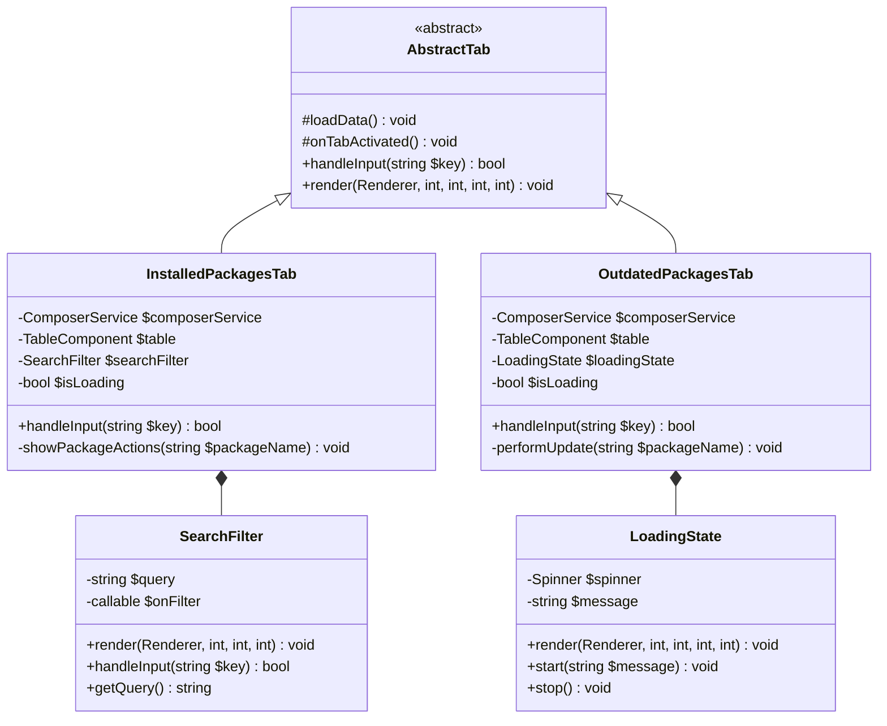
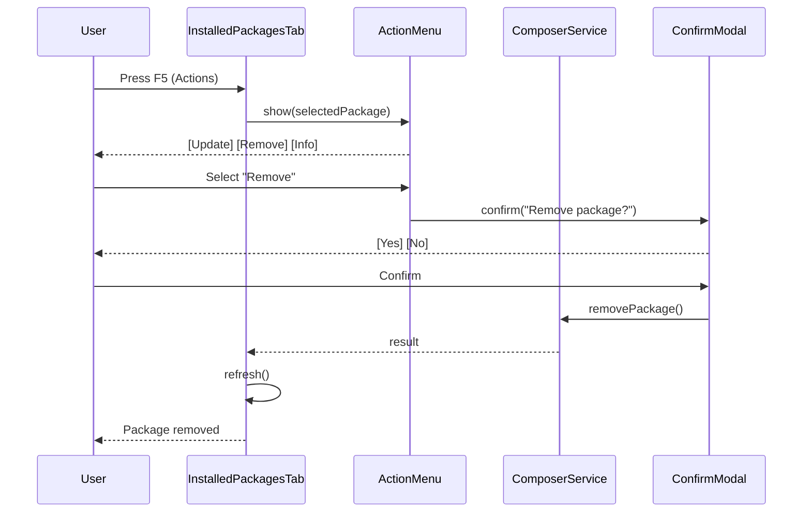

# Feature Request: Composer Manager UX/DX Improvements

## Feature Overview

### Description

Enhance the Composer Manager feature with missing functionality, improved user experience, better developer experience through testing, and code quality improvements. The Composer Manager is a 4-tab terminal UI for managing PHP Composer packages.

### Business Value

- **Usability**: Users can actually update/remove packages instead of just viewing them
- **Discoverability**: Search/filter helps users find packages in large projects
- **Feedback**: Loading indicators prevent perceived freezing during slow operations
- **Reliability**: Unit tests ensure code quality and prevent regressions
- **Maintainability**: Code deduplication and optimizations reduce technical debt

### Target Users

1. **PHP developers** using Commander to manage dependencies
2. **DevOps engineers** auditing security vulnerabilities
3. **Module developers** building on top of Composer functionality

### Current State Analysis

The Composer Manager (`src/Feature/ComposerManager/`) consists of:

```
src/Feature/ComposerManager/
├── Screen/
│   └── ComposerManagerScreen.php      # Main screen (124 lines)
├── Tab/
│   ├── InstalledPackagesTab.php       # Package list (365 lines)
│   ├── OutdatedPackagesTab.php        # Outdated packages (259 lines)
│   ├── SecurityAuditTab.php           # Security audit (247 lines)
│   └── ScriptsTab.php                 # Script execution (626 lines)
├── Service/
│   ├── ComposerService.php            # Core API (712 lines)
│   ├── PackageInfo.php                # Package DTO (122 lines)
│   ├── OutdatedPackageInfo.php        # Outdated DTO (71 lines)
│   ├── SecurityAdvisory.php           # Advisory DTO (35 lines)
│   └── SearchResult.php               # Search DTO (19 lines, UNUSED)
└── Component/
    ├── PackageHeader.php              # Header component (54 lines)
    ├── PackageInfoSection.php         # Info display (44 lines)
    └── ... (6 more components)
```

**Total: ~3,028 lines of PHP code**

---

## Problems Identified

### P0 - Critical UX Issues

#### 1. Misleading "Enter to Update" Hint
**Location**: `src/Feature/ComposerManager/Tab/OutdatedPackagesTab.php:54-58`

```php
public function getShortcuts(): array
{
    return [
        'Tab' => 'Switch Panel',
        'Enter' => 'Update',      // ← MISLEADING: Actually shows details
        'Ctrl+R' => 'Refresh',
    ];
}
```

**Problem**: User sees "Enter to Update" but Enter key actually shows details (same as Installed tab).

**Evidence** (line 184-186):
```php
$table->onSelect(function (array $row, int $index): void {
    // TODO: Implement update package functionality
    $this->showPackageDetails($row);
});
```

---

#### 2. No Loading Indicators for Slow Operations
**Location**: Multiple tabs

**Problem**: When switching to Outdated or Security tabs, or pressing `Ctrl+R`, the UI freezes without feedback while running:
- `composer outdated --format=json` (3-10 seconds)
- `composer audit --format=json` (2-5 seconds)

**User Impact**: Users think the application crashed during slow network operations.

---

### P1 - Missing Functionality

#### 3. No Search/Filter Capability
**Location**: All tabs with package lists

**Problem**: Large projects have 100+ packages. Finding a specific package requires scrolling through the entire list.

**User Impact**: Poor productivity when managing dependencies in large monorepos.

---

#### 4. Incomplete Package Actions
**Location**: `src/Feature/ComposerManager/Service/ComposerService.php`

**Service methods exist but have no UI**:
```php
public function updatePackage(string $packageName, callable $outputCallback): array  // :306
public function removePackage(string $packageName, callable $outputCallback): array  // :328
public function requirePackage(string $packageName, bool $dev, callable $outputCallback): array // :339
```

**User Impact**: Users must exit to terminal to perform common package operations.

---

#### 5. No Confirmation for Destructive Actions
**Location**: `src/Feature/ComposerManager/Tab/ScriptsTab.php:335-341`

```php
private function runScript(string $scriptName): void
{
    if ($this->isExecuting) {
        return;
    }
    $this->performScriptExecution($scriptName);  // ← Immediate execution
}
```

**Problem**: Scripts like `post-update-cmd` or custom destructive scripts execute immediately without confirmation.

---

### P2 - Code Quality Issues

#### 6. Duplicate `findComposerBinary()` Implementation
**Locations**:
- `src/Feature/ComposerManager/Service/ComposerService.php:683-701`
- `src/Feature/ComposerManager/Tab/ScriptsTab.php:548-566`

Both files contain identical 19-line methods:
```php
private function findComposerBinary(): ?string
{
    $candidates = [
        'composer',
        'composer.phar',
        '/usr/local/bin/composer',
        '/usr/bin/composer',
        $_SERVER['HOME'] . '/.composer/composer.phar',
    ];
    // ... identical logic
}
```

---

#### 7. O(n²) Reverse Dependency Lookup
**Location**: `src/Feature/ComposerManager/Service/ComposerService.php:128-149`

```php
public function getReverseDependencies(string $packageName): array
{
    foreach ($installedRepo->getPackages() as $package) {        // O(n)
        foreach ($package->getRequires() as $link) {             // O(m)
            if ($link->getTarget() === $packageName) {
                $dependents[] = $package->getName();
                break;
            }
        }
    }
    return $dependents;
}
```

**Problem**: For each package lookup, iterates all packages. With 200 packages, showing details for each = 40,000 iterations.

---

#### 8. Inconsistent Lazy Loading
**Locations**:
- `src/Feature/ComposerManager/Tab/InstalledPackagesTab.php:106-110` - Always reloads
- `src/Feature/ComposerManager/Tab/OutdatedPackagesTab.php:96-104` - Loads once with flag
- `src/Feature/ComposerManager/Tab/SecurityAuditTab.php:96-104` - Loads once with flag

```php
// InstalledPackagesTab - ALWAYS reloads
protected function onTabActivated(): void
{
    $this->loadData();  // ← No caching check
    $this->updateFocus();
}

// OutdatedPackagesTab - Only loads once
protected function onTabActivated(): void
{
    if (!$this->dataLoaded) {  // ← Flag-based caching
        $this->loadData();
        $this->dataLoaded = true;
    }
    $this->updateFocus();
}
```

---

#### 9. No Unit Tests for Core Logic
**Location**: `tests/Integration/Module/ComposerModuleTest.php` (only test)

**Current coverage**: Only module registration tests exist.

**Missing tests**:
- `ComposerService` methods
- Tab input handling
- Tab rendering
- Component rendering
- Error conditions
- Script execution flow

---

#### 10. Unused `SearchResult` Model
**Location**: `src/Feature/ComposerManager/Service/SearchResult.php`

```php
final readonly class SearchResult
{
    public function __construct(
        public string $name,
        public string $description,
        public string $url,
        public int $downloads,
    ) {}
}
```

**Problem**: Model exists but is never used in any UI component.

---

## Technical Architecture

### Current Data Flow

```
┌─────────────────────────────────────────────────────────────┐
│                  ComposerManagerScreen                        │
│  ┌─────────────────────────────────────────────────────────┐│
│  │                    TabContainer                          ││
│  │  ┌──────────┬───────────┬──────────┬────────────────┐  ││
│  │  │ Scripts  │ Installed │ Outdated │   Security     │  ││
│  │  │   Tab    │    Tab    │   Tab    │     Tab        │  ││
│  │  └────┬─────┴─────┬─────┴────┬─────┴───────┬────────┘  ││
│  └───────┼───────────┼──────────┼─────────────┼────────────┘│
└──────────┼───────────┼──────────┼─────────────┼─────────────┘
           │           │          │             │
           ▼           ▼          ▼             ▼
    ┌──────────────────────────────────────────────────────┐
    │                  ComposerService                      │
    │  ┌────────────┐  ┌─────────────┐  ┌───────────────┐ │
    │  │ Composer   │  │    CLI      │  │    Cache      │ │
    │  │    API     │  │  Commands   │  │  (installed,  │ │
    │  │(metadata)  │  │(outdated,   │  │   outdated)   │ │
    │  │            │  │ audit, etc) │  │               │ │
    │  └────────────┘  └─────────────┘  └───────────────┘ │
    └──────────────────────────────────────────────────────┘
```

### Proposed Enhancements

```
                            NEW COMPONENTS
                                 │
    ┌────────────────────────────┼────────────────────────────┐
    │                            ▼                             │
    │  ┌──────────────┐  ┌──────────────┐  ┌───────────────┐ │
    │  │  LoadingState│  │ SearchFilter │  │ ActionMenu    │ │
    │  │  Component   │  │  Component   │  │ (Update/Del)  │ │
    │  └──────────────┘  └──────────────┘  └───────────────┘ │
    │                                                          │
    │  ┌──────────────┐  ┌──────────────┐  ┌───────────────┐ │
    │  │Confirmation  │  │ DependencyGraph│ │ ComposerBinary│ │
    │  │   Modal      │  │    Cache       │ │   Utility     │ │
    │  └──────────────┘  └──────────────┘  └───────────────┘ │
    └─────────────────────────────────────────────────────────┘
```

---

## Class Diagrams

### Enhanced Tab Structure



### Action Menu Flow



---

## Public API / Interfaces

### New Components

#### SearchFilter Component

```php
<?php

namespace Butschster\Commander\Feature\ComposerManager\Component;

use Butschster\Commander\UI\Component\ComponentInterface;

/**
 * Inline search filter for package tables.
 * Activated with / or Ctrl+F, filters as you type.
 */
final class SearchFilter implements ComponentInterface
{
    private string $query = '';
    private bool $isActive = false;

    /** @var callable(string): void */
    private $onFilter;

    public function __construct(callable $onFilter)
    {
        $this->onFilter = $onFilter;
    }

    public function activate(): void;
    public function deactivate(): void;
    public function isActive(): bool;
    public function getQuery(): string;
    public function render(Renderer $renderer, int $x, int $y, int $width): void;
    public function handleInput(string $key): bool;
}
```

#### LoadingState Component

```php
<?php

namespace Butschster\Commander\Feature\ComposerManager\Component;

/**
 * Full-panel loading state with spinner and message.
 */
final class LoadingState
{
    private Spinner $spinner;
    private ?string $message = null;
    private bool $isLoading = false;

    public function start(string $message): void;
    public function stop(): void;
    public function isLoading(): bool;
    public function render(Renderer $renderer, int $x, int $y, int $width, int $height): void;
    public function update(): void;
}
```

#### PackageActionMenu Component

```php
<?php

namespace Butschster\Commander\Feature\ComposerManager\Component;

/**
 * Context menu for package actions (Update, Remove, Info).
 */
final class PackageActionMenu implements ComponentInterface
{
    public function __construct(
        private readonly ComposerService $composerService,
        private readonly ScreenManager $screenManager,
    ) {}

    public function show(PackageInfo $package): void;
    public function hide(): void;
    public function isVisible(): bool;

    /** @var callable(string, PackageInfo): void */
    public function onAction(callable $callback): void;
}
```

### Enhanced ComposerService

```php
<?php

// New methods to add to ComposerService

/**
 * Build dependency graph for efficient reverse lookups.
 * Call once, then use getDependentsFromGraph() for O(1) lookups.
 *
 * @return array<string, array<string>> Package name => array of dependents
 */
public function buildDependencyGraph(): array;

/**
 * Get dependents from pre-built graph.
 *
 * @param array<string, array<string>> $graph From buildDependencyGraph()
 */
public function getDependentsFromGraph(array $graph, string $packageName): array;

/**
 * Search Packagist for packages.
 *
 * @return array<SearchResult>
 */
public function searchPackagist(string $query, int $limit = 20): array;
```

---

## Directory Structure Changes

```
src/Feature/ComposerManager/
├── Component/
│   ├── ... (existing)
│   ├── SearchFilter.php          # NEW: Search input
│   ├── LoadingState.php          # NEW: Loading indicator
│   └── PackageActionMenu.php     # NEW: Context menu
├── Service/
│   ├── ComposerService.php       # MODIFIED: Add graph, search
│   └── ComposerBinaryLocator.php # NEW: Extract binary finding
├── Tab/
│   ├── InstalledPackagesTab.php  # MODIFIED: Add search, actions
│   ├── OutdatedPackagesTab.php   # MODIFIED: Add loading, update
│   ├── SecurityAuditTab.php      # MODIFIED: Add loading
│   └── ScriptsTab.php            # MODIFIED: Add confirmation
└── Screen/
    └── ComposerManagerScreen.php # UNCHANGED

tests/
├── Unit/
│   └── Feature/
│       └── ComposerManager/
│           ├── Service/
│           │   ├── ComposerServiceTest.php      # NEW
│           │   └── ComposerBinaryLocatorTest.php # NEW
│           ├── Tab/
│           │   ├── InstalledPackagesTabTest.php  # NEW
│           │   ├── OutdatedPackagesTabTest.php   # NEW
│           │   ├── SecurityAuditTabTest.php      # NEW
│           │   └── ScriptsTabTest.php            # NEW
│           └── Component/
│               ├── SearchFilterTest.php          # NEW
│               └── LoadingStateTest.php          # NEW
├── Integration/
│   └── Module/
│       └── ComposerModuleTest.php  # EXISTING
└── E2E/
    └── Scenario/
        └── ComposerManagerE2ETest.php  # NEW
```

---

## Code References

### Files to Modify

| File | Lines | Changes |
|------|-------|---------|
| `src/Feature/ComposerManager/Tab/OutdatedPackagesTab.php` | 259 | Fix hint, add loading, implement update |
| `src/Feature/ComposerManager/Tab/InstalledPackagesTab.php` | 365 | Add search, add actions, fix caching |
| `src/Feature/ComposerManager/Tab/SecurityAuditTab.php` | 247 | Add loading indicator |
| `src/Feature/ComposerManager/Tab/ScriptsTab.php` | 626 | Add confirmation, extract binary locator |
| `src/Feature/ComposerManager/Service/ComposerService.php` | 712 | Add graph, add search, extract binary |

### Key Code Locations

#### TODO to Fix (OutdatedPackagesTab)
```
src/Feature/ComposerManager/Tab/OutdatedPackagesTab.php:184-186
```

#### Duplicate Binary Locator
```
src/Feature/ComposerManager/Service/ComposerService.php:683-701
src/Feature/ComposerManager/Tab/ScriptsTab.php:548-566
```

#### O(n²) Algorithm
```
src/Feature/ComposerManager/Service/ComposerService.php:128-149
```

#### Inconsistent Caching
```
src/Feature/ComposerManager/Tab/InstalledPackagesTab.php:106-110
src/Feature/ComposerManager/Tab/OutdatedPackagesTab.php:96-104
```

#### Unused Search Model
```
src/Feature/ComposerManager/Service/SearchResult.php:1-19
```

---

## Testing Strategy

### Unit Tests

```php
// tests/Unit/Feature/ComposerManager/Service/ComposerServiceTest.php

final class ComposerServiceTest extends TestCase
{
    public function test_getInstalledPackages_returns_sorted_list(): void;
    public function test_getInstalledPackages_uses_cache(): void;
    public function test_getOutdatedPackages_parses_json(): void;
    public function test_runAudit_handles_exit_code_1(): void;
    public function test_buildDependencyGraph_creates_reverse_map(): void;
    public function test_clearCache_invalidates_all_caches(): void;
}

// tests/Unit/Feature/ComposerManager/Component/SearchFilterTest.php

final class SearchFilterTest extends TestCase
{
    public function test_activate_enables_input_mode(): void;
    public function test_typing_updates_query(): void;
    public function test_escape_deactivates(): void;
    public function test_enter_confirms_search(): void;
    public function test_callback_fires_on_query_change(): void;
}

// tests/Unit/Feature/ComposerManager/Tab/OutdatedPackagesTabTest.php

final class OutdatedPackagesTabTest extends TestCase
{
    public function test_enter_triggers_update_confirmation(): void;
    public function test_loading_state_shown_during_fetch(): void;
    public function test_ctrl_r_refreshes_data(): void;
}
```

### Integration Tests

```php
// tests/Integration/Feature/ComposerManager/ComposerServiceIntegrationTest.php

final class ComposerServiceIntegrationTest extends TestCase
{
    private string $testDir;

    protected function setUp(): void
    {
        $this->testDir = sys_get_temp_dir() . '/composer_test_' . uniqid();
        mkdir($this->testDir);
        file_put_contents($this->testDir . '/composer.json', json_encode([
            'name' => 'test/project',
            'require' => ['php' => '^8.3', 'psr/log' => '^3.0'],
        ]));
    }

    public function test_getInstalledPackages_with_real_project(): void;
    public function test_getPackageDetails_returns_full_metadata(): void;
}
```

### E2E Tests

```php
// tests/E2E/Scenario/ComposerManagerE2ETest.php

final class ComposerManagerE2ETest extends TerminalTestCase
{
    public function test_search_filter_narrows_package_list(): void
    {
        $this->terminal()->setSize(120, 40);

        $this->keys()
            ->press('/')           // Activate search
            ->type('symfony')      // Type search query
            ->enter()              // Confirm
            ->frame()
            ->applyTo($this->terminal());

        // ... verify filtered results
    }

    public function test_update_package_shows_confirmation(): void;
    public function test_loading_indicator_during_outdated_fetch(): void;
    public function test_script_execution_with_confirmation(): void;
}
```

---

## Acceptance Criteria

### Must Have (P0)

- [ ] Fix "Enter to Update" hint - either implement or change label
- [ ] Add loading indicators for slow operations
- [ ] Existing functionality continues to work
- [ ] No performance regressions

### Should Have (P1)

- [ ] Implement package update functionality
- [ ] Add search/filter for package lists
- [ ] Add confirmation dialogs for destructive actions
- [ ] Standardize lazy loading across tabs

### Could Have (P2)

- [ ] Add package removal UI
- [ ] Add "require new package" UI
- [ ] Implement Packagist search
- [ ] Optimize reverse dependency lookup
- [ ] Extract duplicate binary locator

### Won't Have (Future)

- [ ] Full Packagist browser
- [ ] Composer lock file diffing
- [ ] Vendor directory size analysis
- [ ] Autoload optimization tools

---

## Migration Path

### Phase 1: Quick Fixes (Stage 1)
1. Fix misleading "Enter to Update" shortcut label
2. Extract duplicate binary locator
3. Standardize tab caching behavior

### Phase 2: Loading States (Stage 2)
1. Create LoadingState component
2. Add to OutdatedPackagesTab
3. Add to SecurityAuditTab
4. Add to refresh operations

### Phase 3: Update Functionality (Stage 3)
1. Implement update confirmation modal
2. Wire Enter key to update flow
3. Add real-time output display
4. Handle errors gracefully

### Phase 4: Search Filter (Stage 4)
1. Create SearchFilter component
2. Add to InstalledPackagesTab
3. Add to OutdatedPackagesTab
4. Add keyboard shortcut (/ or Ctrl+F)

### Phase 5: Testing (Stage 5)
1. Add unit tests for ComposerService
2. Add unit tests for tabs
3. Add unit tests for new components
4. Add E2E tests for workflows

### Phase 6: Advanced Features (Stage 6)
1. Add package action menu (Update/Remove/Info)
2. Implement package removal
3. Optimize dependency graph
4. Consider Packagist search integration
